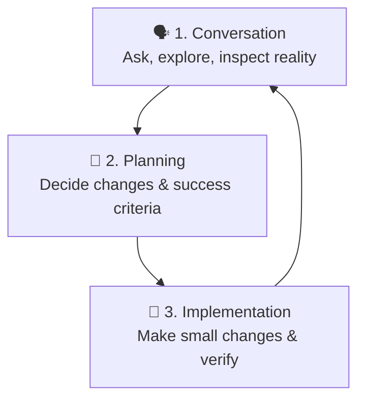

# Getting Started

> **Harness role**: This module helps you create the first readable entry point for the agent and the human reviewer.

This module is for people opening OpenCode for the first time and wondering what to do next.
The goal is to help you build the **first usable harness layer** in a repo that does not yet have strong structure.

---

## Why this matters

Most first-session failures happen because people start asking for implementation before the repository has a readable map.
Without that map, the agent has no system of record, no safe boundary, and no reliable way to tell present facts from future intent.

This module prevents that failure.

---

## 🧭 Who this module is for

Use this module if any of these sound like you:
- you are new to OpenCode
- you can chat with it, but have no reusable setup yet
- you want to understand how to start a repo without inventing structure
- you want a starter file you can copy with minimal cleanup

---

## ⏱️ What you can finish in 15 minutes

By the end of this module, you should be able to:
1. explain the basic OpenCode workflow in plain language
2. separate verified repository facts from future plans
3. create a minimal harness entry point with `AGENTS.md`

---

## What this module assumes, and does not assume

This module assumes:
- you can inspect files in a repository
- you are willing to document facts before asking for bigger changes

This module does **not** assume:
- a package manager exists
- test or build commands exist
- the repo already has CI, hooks, or integrations
- the agent can safely infer missing structure

---

## 🧠 The basic mental model

For a first-time user, OpenCode is easiest to understand as three layers:

The common beginner mistake is skipping straight to implementation before the repository state is clear.
In harness terms, that means trying to execute without first creating the map.

---

## Demo case: your first 15 minutes in a blank-ish repo

### Situation
You open a repo that has a `README.md`, a few folders, and some docs, but no obvious package manifest and no command reference.

### Goal
Create the smallest possible harness entry point so the agent stops guessing.

### Artifacts in play
- `README.md`
- current directory listing
- [`templates/AGENTS.md`](templates/AGENTS.md)

### Desired result
At the end, the repo has a starter `AGENTS.md` that says what is real, what is missing, and what the agent should not invent.

---

## 🛠️ Step-by-step workflow

1. **Inspect the root**
   - look at the top-level files and folders
   - do not interpret yet, just inventory
2. **Separate facts from assumptions**
   - `README.md exists` is a fact
   - `npm test probably works` is an assumption until proven
3. **Mark unknowns as `TBD`**
   - this is the first entropy-control move in the harness
4. **Copy the starter `AGENTS.md`**
   - use the template as a shell, not as truth
5. **Replace placeholders with real repo facts**
   - present files
   - absent toolchains
   - current project direction if documented
6. **Add one safe operating rule**
   - for example: “Do not invent commands that no file defines.”
7. **Re-read the file once as if you were the agent**
   - can you tell what exists?
   - can you tell what is missing?
   - can you tell what would be unsafe to assume?

---

## What good output looks like

A good first harness entry point does four things:
- states what is actually present today
- states what is not yet configured
- prevents invention of commands or structure
- gives the next operator a safe default way to work

---

## Failure modes and recovery

### Failure mode 1: copying the template without replacing placeholders
Recovery: replace every placeholder that could be mistaken for fact.

### Failure mode 2: documenting intended future tooling as present reality
Recovery: move it to `TBD`, `Planned`, or `Not yet present`.

### Failure mode 3: trying to cover every future rule immediately
Recovery: keep the first harness small. Add detail only after repo reality supports it.

---

## Starter asset

Use:
- [`templates/AGENTS.md`](templates/AGENTS.md)

Optional companion:
- [../02-project-context/templates/PROJECT-FACTS-CHECKLIST.md](../02-project-context/templates/PROJECT-FACTS-CHECKLIST.md)

---

## Reader outcome

After this module, you should be able to open a lightly structured repo and create the first harness artifact without inventing tooling.

---

## ⏭️ Suggested next step

After this module:
- go to [02 - Project Context](../02-project-context/README.md)
- go back to [LEARNING-ROADMAP.md](../LEARNING-ROADMAP.md)
- browse [CATALOG.md](../CATALOG.md) for other starter harness assets
