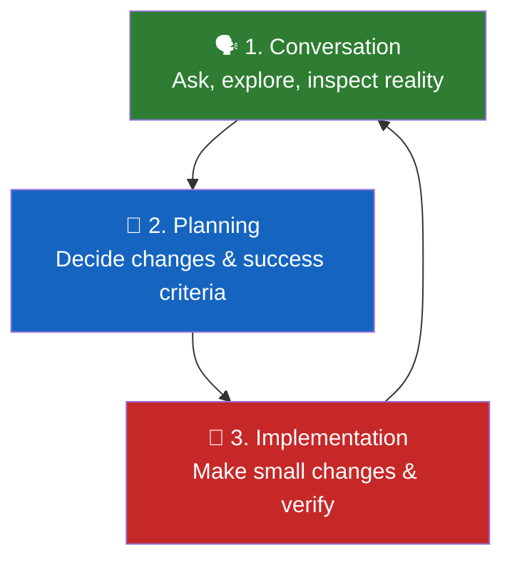

# Getting Started

> **Harness role**: This module helps you create the first readable entry point for the agent and the human reviewer.

This module is for people opening OpenCode for the first time and wondering what to do next.
The goal is to give you one safe mental model, one small starter file, and one clear next step.

---

## 🧭 Who this module is for

Use this module if any of these sound like you:
- you are new to OpenCode
- you can chat with it, but have no reusable setup yet
- you want to understand how to start a project without inventing structure
- you want a starter file you can copy with minimal cleanup

---

## ⏱️ What you can finish in 15 minutes

By the end of this module, you should be able to:
1. explain the basic OpenCode workflow in plain language
2. separate verified repository facts from future plans
3. copy a minimal starter `AGENTS.md` into a project that has no established tooling yet

---

## 🧠 The basic mental model

For a first-time user, OpenCode is easiest to understand as three layers:

The common beginner mistake is skipping straight to implementation before the repository state is clear. That is how people end up inventing commands, files, and structure that are not actually present.

---

## 🛠️ Hands-on Exercise: A safe first-session workflow

When you start with a new repository, use this order:

1. **Inspect** what files actually exist (e.g., `ls -la`, check for `package.json` or `Makefile`).
2. **Identify** which facts are verified by those files.
3. **Mark** unknowns as `TBD` instead of guessing.
4. **Decide** whether the task is docs, scaffolding, templates, or executable code.
5. **Make** the smallest useful change.
6. **Verify** links, filenames, and claims before moving on.

That workflow matters even in documentation-heavy repos. Good docs are still software assets, and they still break when links, assumptions, and status claims drift out of sync.

---

## 📋 Facts first, plans second

This repository uses a simple distinction that is worth learning early:

- **Verified fact**: something supported by files that exist right now
- **Future direction**: something the project intends to become

Examples:
- `README.md exists` is a verified fact
- `This repo will include cross-stack starter kits` is future direction
- `npm test` is only a fact if a real file defines it

> **Core Rule**: Never describe future intent as current reality.

---

## 📄 Your first project-context file

One of the fastest ways to make OpenCode more reliable is to give it a small project-context file. This repository uses `AGENTS.md` as that project-context file.

For a new or lightly structured project, a starter `AGENTS.md` should do four things:
- state what is actually present today
- list what is not yet configured
- tell agents not to invent commands or structure
- set a small, safe default way of working

---

## 🚀 Copy this starter template

Starter template path:
- [`templates/AGENTS.md`](templates/AGENTS.md)

### Exercise: Set up your project context
1. Copy the template into your project as `AGENTS.md`
2. Replace the placeholder repository facts with real ones
3. Remove placeholder wording as soon as your project gains real commands and structure
4. Keep updating it when repository reality changes

**What not to do**:
- do not leave placeholder stack references that are no longer true
- do not claim lint, test, or build commands exist unless files define them
- do not turn a starter template into a fantasy project spec

---

## ⏭️ Suggested next step

After this module:
- go back to [LEARNING-ROADMAP.md](../LEARNING-ROADMAP.md) to see the broader path
- browse [CATALOG.md](../CATALOG.md) to see which reusable artifact types are planned next

The next natural slice after this one is [02 - Project Context](../02-project-context/README.md).
