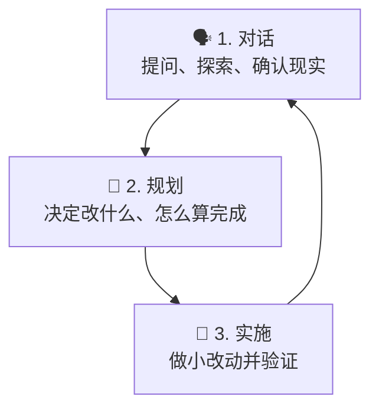

# Getting Started（中文版）

> **Harness 职责**：这个模块帮助你建立 agent 和人类 reviewer 都能读懂的第一个入口。

**语言 / Language：** [简体中文](README.zh-CN.md) | [English](README.md)

这个模块面向第一次打开 OpenCode、但不知道下一步应该做什么的人。
目标是给你一个安全的心智模型、一个小而可用的起步文件，以及一个明确的下一步。

---

## 🧭 这个模块适合谁

如果下面这些情况符合你，就从这里开始：

- 你刚开始使用 OpenCode
- 你已经能聊天，但还没有稳定的可复用设置
- 你想知道怎么开始一个项目，又不想凭空发明结构
- 你想先拿到一个可以直接改写的起步文件

---

## ⏱️ 15 分钟内你能完成什么

学完这个模块，你应该能：

1. 用通俗语言解释 OpenCode 的基础工作流程
2. 区分“已验证事实”和“未来计划”
3. 在一个尚未建立工具链的项目里放入最小可用的 `AGENTS.md`

---

## 🧠 基础心智模型

对于第一次使用的人来说，最容易理解的 OpenCode 结构是三层：

新手最常见的问题，是在仓库状态还没搞清楚之前就直接跳到“实施”。这样很容易发明出根本不存在的命令、文件和结构。

---

## 🛠️ 动手练习：第一次会话的安全流程

当你接手一个新仓库时，推荐按这个顺序来：

1. **先查看** 真实存在的文件
2. **再识别** 哪些结论是已验证事实
3. **把未知项标成** `TBD`
4. **判断** 当前任务是文档、脚手架、模板还是可执行代码
5. **只做最小可用修改**
6. **最后验证** 链接、文件名和描述是否一致

即使是文档仓库，这个顺序也有意义。因为文档本身也是软件资产，也会因为链接错误、假设漂移和状态描述不一致而失效。

---

## 📋 先讲事实，再讲计划

这个仓库一直强调一个简单但非常重要的区分：

- **已验证事实**：能被当前真实文件支持的内容
- **未来方向**：仓库希望未来发展成的样子

例如：

- `README.md` 存在，是事实
- “未来会有 cross-stack starter kits”，是方向
- `npm test` 只有在真实文件定义了它时，才算事实

> **核心规则**：不要把未来意图写成当前现实。

---

## 📄 你的第一个项目上下文文件

让 OpenCode 更可靠的最快方法之一，就是给它一个小而清晰的项目上下文文件。在这个仓库里，这个角色就是 `AGENTS.md`。

对于一个新项目或结构还比较轻的项目来说，一个起步版 `AGENTS.md` 至少要做到四件事：

- 写清今天真实存在什么
- 列出哪些内容还没有配置
- 明确告诉代理不要发明命令或结构
- 设定一个安全的小默认工作方式

---

## 🚀 复制这个起步模板

起步模板路径：

- [`templates/AGENTS.md`](templates/AGENTS.md)（当前为英文模板）

### 练习：建立你的项目上下文

1. 把模板复制成你项目中的 `AGENTS.md`
2. 把占位的仓库事实替换成真实内容
3. 一旦项目有了真实命令和结构，就删掉占位词
4. 当仓库现实变化时，持续更新它

**不要这样做：**

- 不要保留已经不真实的占位 stack 描述
- 不要在没有真实文件支持时声称存在 lint / test / build 命令
- 不要把起步模板写成幻想中的完整项目规范

---

## ⏭️ 建议的下一步

读完这个模块后：

- 回到 [LEARNING-ROADMAP.zh-CN.md](../LEARNING-ROADMAP.zh-CN.md) 看完整学习路径
- 打开 [CATALOG.zh-CN.md](../CATALOG.zh-CN.md) 看当前有哪些可复用资产

最自然的下一站是 [02 - Project Context](../02-project-context/README.zh-CN.md)。
