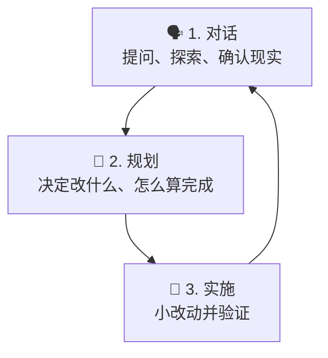

# Getting Started

> **Harness 职责**：这个模块帮助你建立 agent 和人类 reviewer 都能读懂的第一个入口。

这个模块面向第一次打开 OpenCode、但还没有稳定使用方式的人。
目标不是“先学几个功能”，而是先搭起 **第一个可用的 harness 入口层**。

---

## 为什么这很重要

很多第一次使用失败，不是因为模型不够强，而是因为仓库里根本没有给 agent 一个能读的入口。
没有入口，就没有 system of record，没有安全边界，也没有办法区分“当前事实”和“未来打算”。

这个模块就是用来防止这种失败的。

---

## 🧭 这个模块适合谁

如果下面这些情况符合你，就从这里开始：
- 你是第一次用 OpenCode
- 你能聊天，但还没有稳定的可复用 setup
- 你想开始一个 repo，但不想凭空发明结构
- 你想先拿到一个可以直接改写的 starter file

---

## ⏱️ 15 分钟内你能完成什么

学完这个模块后，你应该能：
1. 用通俗语言解释 OpenCode 的基础工作方式
2. 区分已验证事实和未来计划
3. 建立一个最小可用的 `AGENTS.md` 入口

---

## 这个模块假设什么，不假设什么

这个模块假设：
- 你能查看仓库文件
- 你愿意先记录事实，再让 agent 做更大的动作

这个模块不假设：
- 仓库已经有 package manager
- 仓库已经有 test / build / lint 命令
- 仓库已经有 CI、hooks 或 integrations
- agent 可以自动推断缺失结构

---

## 🧠 基础心智模型

对新手来说，OpenCode 最容易理解成 3 层：

最常见的错误，是在仓库状态还没搞清楚之前，就直接跳到“实施”。
从 harness 角度看，这等于还没建地图就开始执行。

---

## Demo case：你接手一个“半空白”仓库的前 15 分钟

### Situation
你打开一个仓库，能看到 `README.md`、几个目录、一些文档，但没有明显的 package manifest，也没有命令说明。

### Goal
给这个仓库建立一个最小可用的 harness 入口，让 agent 停止猜测。

### Artifacts in play
- `README.md`
- 根目录文件清单
- [`templates/AGENTS.md`](templates/AGENTS.md)

### Desired result
仓库里出现一个 starter `AGENTS.md`，明确说明：
- 现在真实存在什么
- 现在还没有什么
- agent 不应该发明什么

---

## 🛠️ Step-by-step workflow

1. **先看根目录**
   - 只做 inventory，不急着解释
2. **把事实和猜测分开**
   - `README.md` 存在，是事实
   - “大概有 `npm test`”，是猜测
3. **把未知项写成 `TBD`**
   - 这是最初级的 entropy 控制动作
4. **复制 starter `AGENTS.md`**
   - 把它当 shell，不要当事实
5. **把占位内容替换成真实仓库事实**
6. **加上一条安全默认规则**
   - 例如：不要发明不存在的命令
7. **再读一遍，假装自己是 agent**
   - 能不能看懂现在有什么？
   - 能不能看懂哪些还没有？

---

## 什么算好结果

一个好的第一版 harness 入口至少要做到：
- 写清今天真实存在什么
- 写清哪些内容还没配置
- 防止发明命令或结构
- 给下一个操作者一个安全默认工作方式

---

## 常见失败模式与修复

### 失败模式 1：复制模板后不替换占位内容
修复：所有可能被误认为事实的占位词都要替换或删掉。

### 失败模式 2：把未来方向写成当前现实
修复：改成 `TBD`、`Planned` 或 `Not yet present`。

### 失败模式 3：第一次就试图把所有未来规则写全
修复：先做小而真的 harness，再慢慢加层。

---

## Starter asset

使用：
- [`templates/AGENTS.md`](templates/AGENTS.md)

可选搭配：
- [../02-project-context/templates/PROJECT-FACTS-CHECKLIST.md](../02-project-context/templates/PROJECT-FACTS-CHECKLIST.md)

---

## Reader outcome

学完这个模块后，你应该能在一个结构还很轻的 repo 里，建立第一个可靠 harness 入口，而不是靠猜。

---

## ⏭️ 建议下一步

继续看 [02 - Project Context](../02-project-context/README.zh-CN.md)。

另外你也可以：
- 回到 [LEARNING-ROADMAP.zh-CN.md](../LEARNING-ROADMAP.zh-CN.md) 看完整 Harness 路径
- 打开 [CATALOG.zh-CN.md](../CATALOG.zh-CN.md) 浏览当前 starter harness 资产
