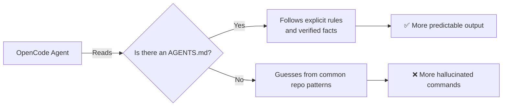

# Project Context

> **Harness role**: This module turns your repository into a system of record instead of a pile of assumptions.

This module explains how to ground OpenCode in your repository's actual state.
The goal is to move from scattered repo facts to a **maintained harness context layer**.

---

## Why this matters

Without project context, the agent substitutes probability for truth.
That is how teams end up with invented scripts, fake framework assumptions, and reviews that drift away from the repository.

This module prevents that by teaching you how to turn the repo into a readable system of record.

---

## 🧭 Who this module is for

Use this module if:
- you want OpenCode to stop hallucinating nonexistent scripts or frameworks
- you are starting to share a repository with others or with multiple agents
- you want a systematic way to track what your project actually does

---

## ⏱️ What you can finish in 15 minutes

By the end of this module, you should be able to:
1. define the difference between implicit and explicit project context
2. audit a repository into facts, `TBD`, and future direction
3. update `AGENTS.md` using a real evidence trail

---

## What this module assumes, and does not assume

This module assumes:
- you can inspect repo files
- you can edit documentation

This module does **not** assume:
- the repo already has a stable stack
- commands are already documented correctly
- automation or CI exist

---

## 🧠 Why context files matter

OpenCode does not automatically know your project's unwritten rules.
If you do not provide context, it will guess from common patterns.

---

## Demo case: turn a repo audit into a system of record

### Situation
A repo has docs, a few directories, and maybe a `.github/` folder, but no obvious build system and no explicit command reference.

### Goal
Produce a context audit that can be copied into `AGENTS.md` and used by future agents.

### Artifacts in play
- repository root files
- `.github/` support files
- [`templates/PROJECT-FACTS-CHECKLIST.md`](templates/PROJECT-FACTS-CHECKLIST.md)
- `AGENTS.md`

### Desired result
The repo has an explicit facts layer that distinguishes:
- **verified now**
- **not yet present**
- **future direction**

---

## 🛠️ Step-by-step workflow

1. **Open the checklist**
   - do not fill it from memory
2. **Inspect one category at a time**
   - core files
   - stack files
   - commands
   - conventions
3. **For every item, demand evidence**
   - file exists
   - config exists
   - command is actually defined somewhere
4. **Sort each item into one of three buckets**
   - verified fact
   - `TBD` / not yet present
   - future direction
5. **Look for dangerous assumptions**
   - package manager guessed from habit
   - tests assumed because `.github/` exists
   - framework assumed because file names look familiar
6. **Update `AGENTS.md` from the audit**
   - only carry forward things you actually verified
7. **Keep the checklist as working evidence**
   - it is not just a one-time form, it is part of harness maintenance

---

## What good output looks like

A strong context layer lets a new agent answer these questions without guessing:
- what files really exist?
- what commands are truly verified?
- what conventions are real versus aspirational?
- what should remain marked `TBD`?

---

## Failure modes and recovery

### Failure mode 1: treating intended direction as current repo state
Recovery: label it as planned, provisional, or `TBD`.

### Failure mode 2: documenting commands because they are common in similar repos
Recovery: require a real file to define them.

### Failure mode 3: updating `AGENTS.md` but not the evidence checklist
Recovery: keep the checklist and `AGENTS.md` in sync so the harness has traceability.

---

## Starter asset

Use:
- [`templates/PROJECT-FACTS-CHECKLIST.md`](templates/PROJECT-FACTS-CHECKLIST.md)

Then update:
- [../AGENTS.md](../AGENTS.md)

---

## Reader outcome

After this module, you should be able to turn a vague repository into a documented system of record that agents can actually trust.

---

## ⏭️ Suggested next step

Continue to [03 - Commands and Prompts](../03-commands-and-prompts/README.md) to turn that context into explicit execution contracts.
