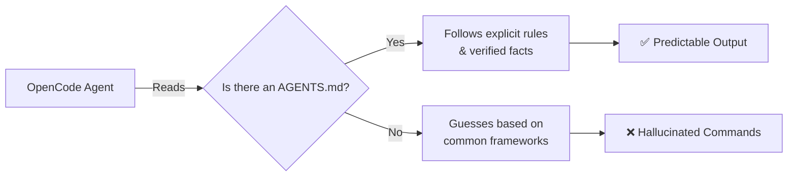

# Project Context

This module explains how to ground OpenCode in your repository's actual state.
The goal is to move from a beginner's mental model to a repeatable, documented repository pattern.

---

## 🧭 Who this module is for

Use this module if:
- you want OpenCode to stop hallucinating nonexistent scripts or frameworks
- you are starting to share a repository with others (or other agents)
- you want a systematic way to track what your project actually does

---

## ⏱️ What you can finish in 15 minutes

By the end of this module, you should be able to:
1. define the difference between implicit and explicit project context
2. use a checklist to audit your repository's actual state
3. maintain a living source of truth for your agents

---

## 🧠 Why context files matter

OpenCode is powerful, but it doesn't intuitively know your project's unwritten rules. If you don't provide a context file, it will guess based on common conventions.

By providing explicit context, you anchor the agent to reality.

---

## 🛠️ Hands-on Exercise: Auditing your project

We use a simple checklist to audit the repository state before writing or updating context files.

**Starter template path**:
- [`templates/PROJECT-FACTS-CHECKLIST.md`](templates/PROJECT-FACTS-CHECKLIST.md)

### Exercise Instructions:
1. Copy the `PROJECT-FACTS-CHECKLIST.md` into your workspace.
2. Go through each section: Core, Stack, Commands, and Conventions.
3. For each item, physically verify if the file/tool exists (e.g., run `ls package.json` or `cat Makefile`).
4. If it exists, mark it as verified. If it doesn't, mark it as `TBD`.
5. Use this completed checklist to update your `AGENTS.md`.

---

## 🔄 Keeping context alive

Context files rot if they aren't maintained. 

**Best Practice**: Treat your context file like a dependency lockfile.
- Did you add a linter? Update the context file.
- Did you change from `npm` to `pnpm`? Update the context file.
- Did you establish a new naming convention? Update the context file.

If the context file is wrong, the agent will be wrong.

---

## ⏭️ Suggested next step

Once your project context is grounded in reality, you are ready to start making repeatable requests. 
Proceed to [03 - Commands and Prompts](../03-commands-and-prompts/README.md).
