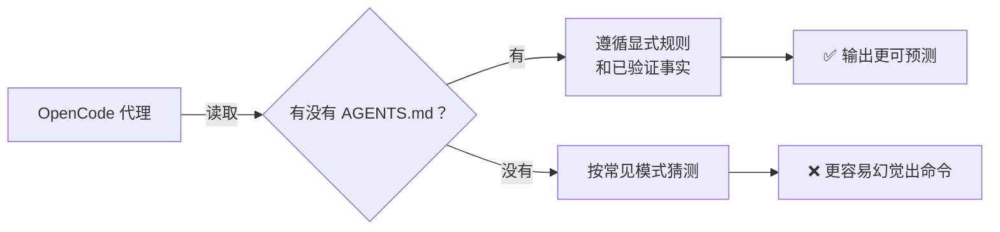

# Project Context

> **Harness 职责**：这个模块把仓库从“很多假设”变成真正的 system of record。

这个模块解释怎样把 OpenCode 锚定在仓库的真实状态上。
目标是从零散事实，走向一个**可维护的上下文层**。

---

## 为什么这很重要

没有项目上下文时，agent 只能用“高概率猜测”代替“真实事实”。
这就是发明脚本、误判框架、文档越写越漂的根源。

这个模块的作用，就是把仓库变成 agent 可以真的信任的 system of record。

---

## 🧭 这个模块适合谁

如果你有这些需求，就读这一章：
- 你想让 OpenCode 停止脑补不存在的脚本或框架
- 你开始和其他人或其他 agent 共用一个仓库
- 你想系统追踪“这个项目现在到底是什么状态”

---

## ⏱️ 15 分钟内你能完成什么

读完之后，你应该能：
1. 解释隐式项目上下文和显式项目上下文的区别
2. 把仓库内容分成事实、`TBD` 和未来方向
3. 用事实审计结果更新 `AGENTS.md`

---

## 这个模块假设什么，不假设什么

这个模块假设：
- 你能查看 repo 文件
- 你能编辑文档

这个模块不假设：
- repo 已经选定 stack
- 命令文档已经是真实的
- automation 或 CI 已经存在

---

## 🧠 为什么上下文文件重要

OpenCode 不会自动知道项目里那些“大家心里都懂”的规则。
如果你不给它显式上下文，它就会按常见模式去猜。

---

## Demo case：把 repo audit 变成 system of record

### Situation
一个仓库有文档、有目录、可能还有 `.github/`，但没有明显 build system，也没有明确命令说明。

### Goal
做出一份上下文审计结果，并把它写进 `AGENTS.md`。

### Artifacts in play
- 根目录文件
- `.github/` 支持文件
- [`templates/PROJECT-FACTS-CHECKLIST.md`](templates/PROJECT-FACTS-CHECKLIST.md)
- `AGENTS.md`

### Desired result
仓库里的上下文被明确分成：
- **已经验证的事实**
- **not yet present / `TBD`**
- **未来方向**

---

## 🛠️ Step-by-step workflow

1. **打开 checklist**
   - 不要凭记忆填写
2. **按类别逐项检查**
   - core files
   - stack files
   - commands
   - conventions
3. **每一项都要求证据**
   - 文件真的存在吗？
   - 配置真的存在吗？
   - 命令真的有定义吗？
4. **把每项分到 3 个桶里**
   - verified fact
   - `TBD` / not yet present
   - future direction
5. **找出危险猜测**
   - 习惯性猜 package manager
   - 因为有 `.github/` 就假设有 tests
   - 因为文件名眼熟就假设框架
6. **用审计结果更新 `AGENTS.md`**
7. **把 checklist 当成持续证据，不是一份一次性表格**

---

## 什么算好结果

一个好的 context layer 能让新 agent 在不猜的情况下回答：
- 现在真实有哪些文件？
- 哪些命令真的是 verified？
- 哪些是习惯写法，哪些只是未来打算？
- 哪些必须继续写成 `TBD`？

---

## 常见失败模式与修复

### 失败模式 1：把未来方向写成当前状态
修复：标成 planned、provisional 或 `TBD`。

### 失败模式 2：因为“别的 repo 常常这样”就写进来
修复：必须有真实文件作为证据。

### 失败模式 3：只更新 `AGENTS.md`，不保留审计痕迹
修复：让 checklist 和 `AGENTS.md` 保持同步。

---

## Starter asset

使用：
- [`templates/PROJECT-FACTS-CHECKLIST.md`](templates/PROJECT-FACTS-CHECKLIST.md)

然后更新：
- [../AGENTS.md](../AGENTS.md)

---

## Reader outcome

学完这个模块后，你应该能把一个模糊的仓库状态整理成 agent 能信任的事实层。

---

## ⏭️ 建议下一步

继续看 [03 - Commands and Prompts](../03-commands-and-prompts/README.zh-CN.md)。
