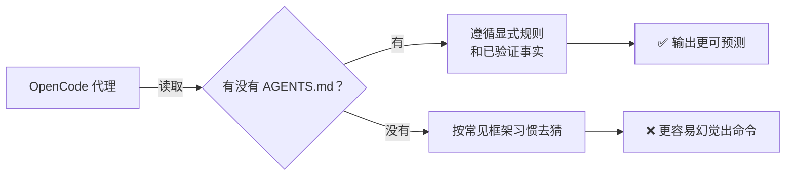

# Project Context（中文版）

> **Harness 职责**：这个模块把仓库从“很多假设”变成真正的 system of record。

**语言 / Language：** [简体中文](README.zh-CN.md) | [English](README.md)

这个模块解释的是：怎样把 OpenCode 锚定在你仓库的真实状态上。
目标是从“新手的直觉式使用”，走到“可重复、可文档化的仓库模式”。

---

## 🧭 这个模块适合谁

如果你有下面这些需求，这个模块就适合你：

- 你想让 OpenCode 停止脑补不存在的脚本或框架
- 你开始和别人（或别的代理）共享同一个仓库
- 你想系统地追踪“这个项目现在真实是什么样子”

---

## ⏱️ 15 分钟内你能完成什么

读完之后，你应该能：

1. 说清楚“隐式项目上下文”和“显式项目上下文”的区别
2. 用检查清单审查仓库当前真实状态
3. 维护一个对代理有效的事实来源

---

## 🧠 为什么上下文文件重要

OpenCode 很强，但它不会自动知道你项目里那些没有写出来的规则。如果你不给它显式上下文，它就会按常见习惯去猜。

上下文文件的作用，就是把代理牢牢拴回现实。

---

## 🛠️ 动手练习：审查你的项目

在编写或更新上下文文件之前，这个仓库推荐先用一个简单清单审查仓库现状。

**起步模板路径：**

- [`templates/PROJECT-FACTS-CHECKLIST.md`](templates/PROJECT-FACTS-CHECKLIST.md)（当前为英文模板）

### 练习步骤

1. 打开 `PROJECT-FACTS-CHECKLIST.md`
2. 按 Core、Stack、Commands、Conventions 逐项检查
3. 每一项都以真实文件或工具为依据去确认它是否存在
4. 存在就标记为 verified，不存在就标记为 `TBD`
5. 用这份完成后的清单去更新你的 `AGENTS.md`

---

## 🔄 让上下文持续有效

上下文文件如果不维护，就会很快腐烂。

**一个好习惯**：把上下文文件当成依赖锁文件一样对待。

- 新加了 linter？更新上下文文件
- 从 `npm` 换成 `pnpm`？更新上下文文件
- 建立了新的命名约定？更新上下文文件

上下文文件错了，代理输出通常也会跟着错。

---

## ⏭️ 建议的下一步

当你的项目上下文已经被真实文件支撑起来之后，下一步就是学会发出更稳定、可重复的请求。

继续看 [03 - Commands and Prompts](../03-commands-and-prompts/README.zh-CN.md)。
