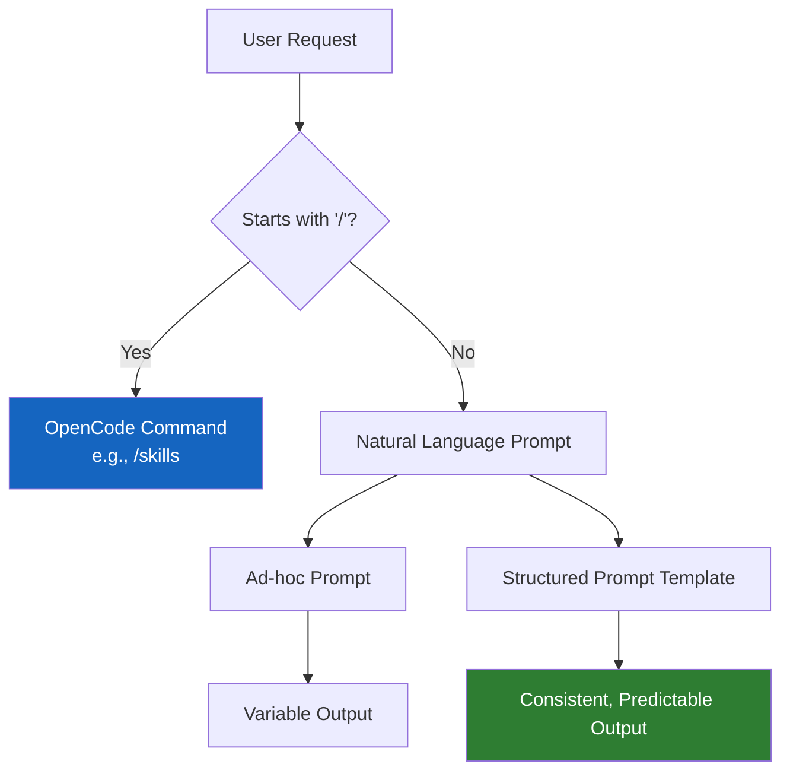

# Commands and Prompts

This module covers reusable request patterns. It separates official OpenCode command terminology (like `/help` or `/skills`) from the structured prompts you use to ask for work.

---

## 🧭 Who this module is for

Use this module if:
- you are tired of typing out long, repetitive instructions
- you want consistent planning and review behavior from your agents
- you want to build a library of copy-paste request structures

---

## ⏱️ What you can finish in 15 minutes

By the end of this module, you should be able to:
1. differentiate between an OpenCode native command and a prompt template
2. use structured templates for planning, reviewing, and committing code
3. build a library of your own prompt patterns

---

## 🧠 Commands vs. Prompts

In OpenCode:
- **Commands**: Built-in instructions starting with a slash (e.g., `/skills`, `/playwright`, `/start-work`) or native tools.
- **Prompts**: Natural language instructions you provide to guide an agent's behavior.

When we talk about "reusable request structures" here, we mean **Prompts**, not custom slash commands (which OpenCode handles via Skills and Agents).

---

## 🛠️ Hands-on Exercise: Structured Requests

A good prompt pattern isn't just a list of instructions; it sets the context, defines the goal, provides constraints, and requests an explicit output format.

**Starter templates**:
- [`templates/PLAN-REQUEST.md`](templates/PLAN-REQUEST.md)
- [`templates/REVIEW-REQUEST.md`](templates/REVIEW-REQUEST.md)
- [`templates/COMMIT-REQUEST.md`](templates/COMMIT-REQUEST.md)
- [`templates/PR-REQUEST.md`](templates/PR-REQUEST.md)

### Exercise Instructions:
1. Identify a task you do often (e.g., reviewing a PR, planning a new feature, writing a commit message).
2. Choose the corresponding template from the `templates` directory.
3. Fill in the specific context (e.g., the PR description, the feature requirements).
4. Send the structured prompt to OpenCode.
5. Notice how the response is much more targeted and actionable than a vague request.

---

## 🏗️ Expanding your library

As your project grows, your library of structured requests will expand. Keep them in a dedicated folder (e.g., `.opencode/prompts/`) so your whole team can reuse them.

---

## ⏭️ Suggested next step

Once you have reusable prompts, you might find that some tasks are so complex or require such specialized knowledge that a simple prompt isn't enough. 
That's when you graduate to [04 - Skills and Agents](../04-skills-and-agents/README.md).
