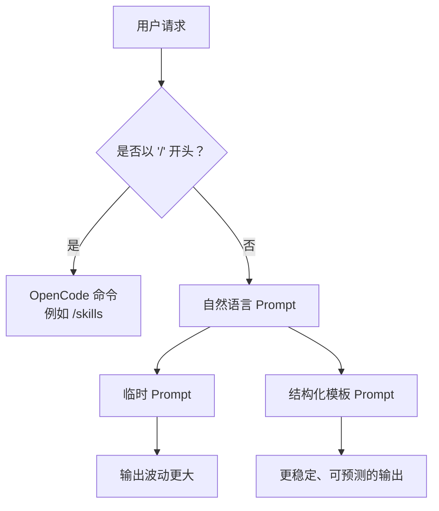

# Commands and Prompts（中文版）

> **Harness 职责**：这个模块为 agent 提供明确执行合同，而不是模糊聊天意图。

**语言 / Language：** [简体中文](README.zh-CN.md) | [English](README.md)

这个模块讨论的是：如何把重复出现的请求整理成可复用的结构。
它会明确区分 OpenCode 的官方命令术语（例如 `/help`、`/skills`）和你自己在聊天中使用的结构化提示。

---

## 🧭 这个模块适合谁

如果下面这些问题你经常遇到，就从这里开始：

- 你厌倦了每次都从头写一大段指令
- 你想让代理在规划、评审、提交说明这些事情上更稳定
- 你想建立一套能复制、能共享的请求模板库

---

## ⏱️ 15 分钟内你能完成什么

读完之后，你应该能：

1. 分清 OpenCode 原生命令和提示模板的区别
2. 使用结构化模板来做计划、评审和提交说明
3. 开始建立自己的请求模式库

---

## 🧠 Commands vs. Prompts

在 OpenCode 里：

- **Commands**：以 `/` 开头的内建命令，或者系统原生能力
- **Prompts**：你用自然语言写出来、用来引导代理行为的请求

这个仓库里说的“可复用请求结构”，重点是 **Prompts**，不是自定义 slash command。

---

## 🛠️ 动手练习：结构化请求

一个好的请求模板不只是列出要求。它还应该给出背景、目标、约束和期望输出格式。

**起步模板：**

- [`templates/PLAN-REQUEST.md`](templates/PLAN-REQUEST.md)
- [`templates/REVIEW-REQUEST.md`](templates/REVIEW-REQUEST.md)
- [`templates/COMMIT-REQUEST.md`](templates/COMMIT-REQUEST.md)
- [`templates/PR-REQUEST.md`](templates/PR-REQUEST.md)

> 这些模板目前都是真实存在的，但正文仍为英文版。

### 练习步骤

1. 选一个你经常做的任务，比如评审 PR、规划新功能、写 commit message
2. 从 `templates` 目录里选对应模板
3. 补上具体上下文，例如需求、PR 描述或变更背景
4. 把这段结构化请求发给 OpenCode
5. 对比一下，它通常会比含糊请求给出更聚焦的结果

---

## 🏗️ 扩展你的模板库

随着项目变大，你的请求模板库也会变大。可以考虑把它们放到单独目录里，让整个团队复用。

---

## ⏭️ 建议的下一步

当你已经有了一套稳定的请求模板，你会开始遇到另一类问题：有些任务太复杂，或者需要的知识太专业，单靠模板已经不够。

这时就该进入 [04 - Skills and Agents](../04-skills-and-agents/README.zh-CN.md)。
