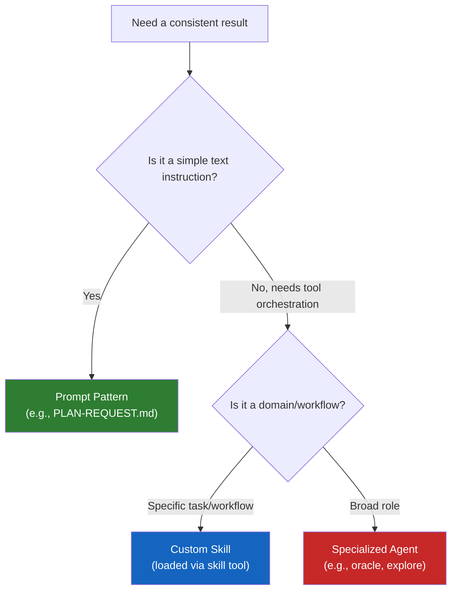

# Skills and Agents

This module explains when reusable capabilities are worth creating and how to use OpenCode's built-in agents and skills.
The goal is to help beginners understand specialization without turning every workflow into a complex system too early.

Official OpenCode docs use **Agents** and **Agent Skills** as real product terms. In this repository, “prompt pattern” remains a teaching term for reusable request structure, while agent and skill references should stay aligned with the official product vocabulary.

---

## 🧭 Who this module is for

Use this module if:
- you see repeated kinds of work in your repository
- you want more consistent planning, review, or writing behavior
- you are trying to decide whether specialization is worth it yet
- you want to understand OpenCode's built-in specialized agents (`explore`, `librarian`, `oracle`, etc.)

---

## ⏱️ What you can finish in 15 minutes

By the end of this module, you should be able to:
1. explain the difference between a reusable skill and a specialized agent
2. identify when specialization helps and when it is premature
3. describe a small, safe path from prompting to reuse
4. load a custom skill using OpenCode's `skill` tool

---

## 🧠 A practical distinction

Use this simple model:

- **prompt pattern**: reusable wording for a repeated request in this repo’s teaching language
- **skill**: a reusable OpenCode skill, typically packaged as `SKILL.md`, providing specialized knowledge and step-by-step guidance.
- **agent**: an OpenCode subagent with a more specialized role or workflow boundary (e.g., `explore`, `librarian`, `oracle`, `visual-engineering`, `ultrabrain`, `deep`).

You do not need all three at once.

---

## ⚙️ Built-in OpenCode Agents

OpenCode ships with several powerful built-in agents designed for specific domains. You invoke them via the `task()` tool:

| Agent / Category | Best For | When to use |
|---|---|---|
| `explore` | Contextual Grep | Searching your own codebase, finding patterns |
| `librarian` | Reference Grep | Searching external docs, OSS examples, web |
| `oracle` | Consultation | Architecture decisions, hard debugging, self-review |
| `visual-engineering` | Frontend/UI | CSS, layout, animations, design implementation |
| `ultrabrain` | Hard logic | Complex algorithms, architecture design |
| `deep` | Autonomous | Goal-oriented problem-solving with thorough research |

> **Pro Tip**: Use `explore` and `librarian` agents in parallel as background tasks to gather context before making changes.

---

## 🛠️ Hands-on Exercise: When to Specialize

Specialization usually becomes worth it when the same work keeps happening and quality depends on a consistent approach.

**Starter checklist path**:
- [`templates/SPECIALIZATION-DECISION-CHECKLIST.md`](templates/SPECIALIZATION-DECISION-CHECKLIST.md)

**Starter skill template**:
- [`templates/skills/self-assessment/README.md`](templates/skills/self-assessment/README.md)

### Exercise Instructions:
1. Identify a repeated task in your workflow.
2. Open the `SPECIALIZATION-DECISION-CHECKLIST.md`.
3. Answer the questions to determine if this task should remain a prompt pattern, become a custom skill, or be delegated to a specialized agent.
4. If it's a skill, try creating a basic `SKILL.md` file in your repository.

If you want a concrete beginner-friendly example of a reusable skill artifact, start with the self-assessment template and its usage notes in `templates/skills/self-assessment/`.

---

## ⏭️ Suggested next step

Once you have specialized skills and agents working for you, the next step is automating the triggers.
Proceed to [05 - Hooks and Automation](../05-hooks-and-automation/README.md).
