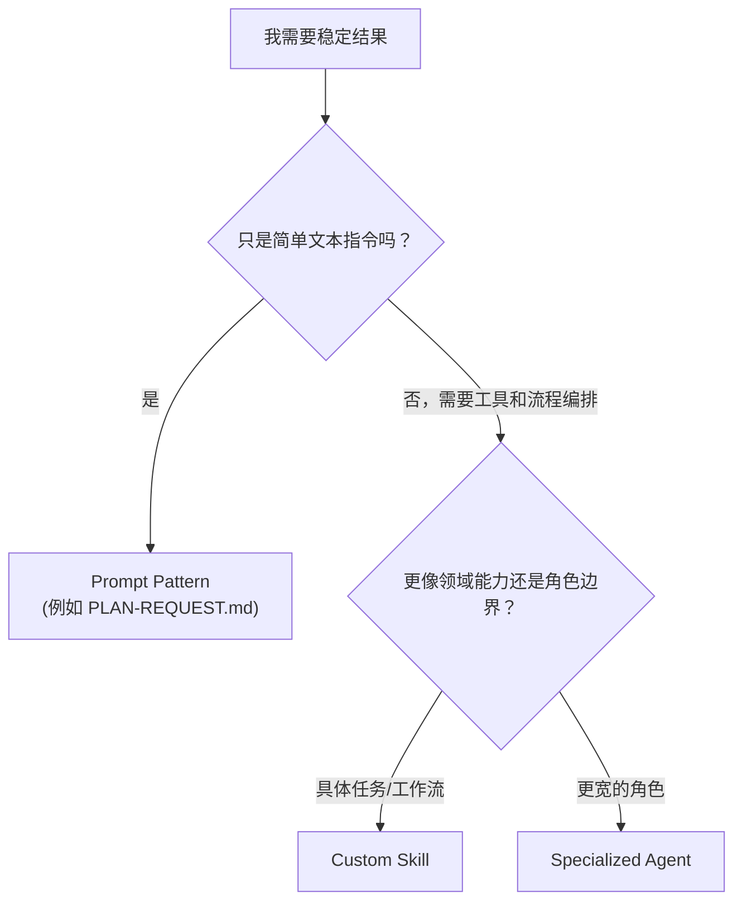

# Skills and Agents（中文版）

> **Harness 职责**：这个模块帮助你把任务路由到正确能力边界，而不是所有事都混着处理。

**语言 / Language：** [简体中文](README.zh-CN.md) | [English](README.md)

这个模块解释的是：什么时候值得把能力做成可复用的 skill，什么时候应该交给更专业的 agent，以及什么时候一个普通 prompt 就够了。

目标是帮助新手理解“专业化”这件事，而不是一开始就把工作流搞得过于复杂。

---

## 🧭 这个模块适合谁

如果你已经开始看到这些问题，就读这一章：

- 某类工作在你的仓库里反复出现
- 你想让计划、评审或写作行为更稳定
- 你在判断到底值不值得做专业化
- 你想理解 OpenCode 的内建专业代理，例如 `explore`、`librarian`、`oracle`

---

## ⏱️ 15 分钟内你能完成什么

学完这个模块后，你应该能：

1. 解释可复用 skill 和专业 agent 的区别
2. 判断专业化什么时候真正有帮助，什么时候只是过早优化
3. 描述一条从 prompt 走向复用的安全路径
4. 理解 OpenCode 里 `skill` 工具的大致角色

---

## 🧠 一个实用区分法

可以用这个简单模型：

- **prompt pattern**：重复请求的固定写法
- **skill**：通常以 `SKILL.md` 形式存在的可复用能力
- **agent**：承担更明确角色边界的专业代理，例如 `explore`、`librarian`、`oracle`

并不是每个项目都需要把三者都用上。

---

## ⚙️ OpenCode 内建代理

OpenCode 自带一些专业代理，适用于不同任务：

| 代理 / 类别 | 最擅长 | 什么时候用 |
|---|---|---|
| `explore` | 在你自己的代码库里做上下文搜索 | 找结构、找模式、找已有实现 |
| `librarian` | 查外部文档、开源例子和网页资料 | 理解外部依赖、官方 API、现成实践 |
| `oracle` | 咨询式高质量判断 | 架构权衡、困难调试、自审 |
| `visual-engineering` | 前端 / UI / 样式 | CSS、布局、动画、界面实现 |
| `ultrabrain` | 硬逻辑与复杂设计 | 复杂算法、棘手结构问题 |
| `deep` | 目标导向的端到端研究 | 更长链路的问题求解 |

> **小建议**：在你真正开始改东西之前，先并行跑 `explore` 和 `librarian` 往往更稳。

---

## 🛠️ 动手练习：什么时候该专业化

一般来说，当同一类工作不断重复，而且质量依赖稳定方式时，专业化才值得做。

**起步检查清单：**

- [`templates/SPECIALIZATION-DECISION-CHECKLIST.md`](templates/SPECIALIZATION-DECISION-CHECKLIST.md)（英文模板）

**起步 skill 示例：**

- [`templates/skills/self-assessment/README.md`](templates/skills/self-assessment/README.md)（英文说明页）

### 练习步骤

1. 找一个你工作里会反复出现的任务
2. 打开 `SPECIALIZATION-DECISION-CHECKLIST.md`
3. 回答问题，判断它更适合继续保持为 prompt pattern、做成 custom skill，还是交给专业 agent
4. 如果结论是值得做 skill，再开始设计一个基础 `SKILL.md`

如果你想看一个更具体的新手示例，就从 self-assessment 模板说明开始。

---

## ⏭️ 建议的下一步

当你已经理解什么时候该用 skill、什么时候该用 agent，下一步就是考虑：哪些行为应该自动触发，哪些仍然要保留人工边界。

继续看 [05 - Hooks and Automation](../05-hooks-and-automation/README.zh-CN.md)。
