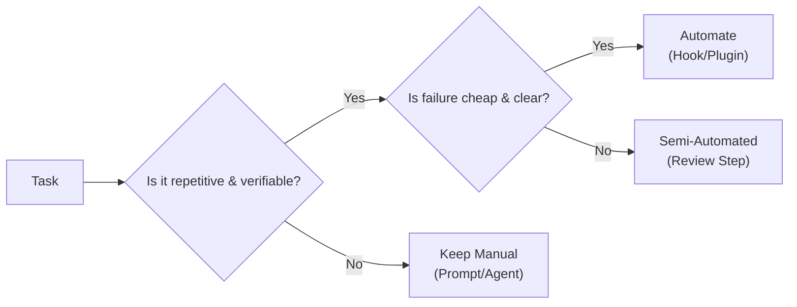

# Hooks and Automation

> **Harness role**: This module adds internal guardrails and repeatable automation behavior to the harness.

This module covers automation boundaries, with hooks understood through the official plugins framing. The goal is to establish safe guardrails for OpenCode without creating fragile, invisible rules.

---

## Why this matters

Automation scales whatever judgment you put into it.
If the boundary is good, automation reduces repetition and catches mistakes early. If the boundary is bad, automation spreads confusion faster than a human can correct it.

This module is about choosing automation boundaries that help the harness instead of destabilizing it.

---

## 🧭 Who this module is for

Use this module if:
- you want OpenCode to run checks automatically
- you want to enforce repeated quality rules without typing them every time
- you need to know what should remain manual in a docs-first repo

---

## ⏱️ What you can finish in 15 minutes

By the end of this module, you should be able to:
1. explain what an OpenCode hook is and when to use it
2. define what should stay manual vs automated
3. audit a repo for automation readiness without inventing tooling

---

## What this module assumes, and does not assume

This module assumes:
- some tasks repeat often enough to tempt automation
- the repo already has basic context and execution contracts

This module does **not** assume:
- your repo already has hook support configured
- your repo already has working test or lint commands
- automation is always better than a manual checkpoint

---

## 🧠 The automation boundary

Automation is a multiplier: it scales good practices, but it also scales mistakes.

---

## Demo case: classify this repo's repeated checks

### Situation
This repository is docs-first. It does not have a verified package manager or test suite, but it does have many repeated documentation integrity checks.

### Goal
Decide which repeated checks belong in automation and which ones should remain manual.

### Candidate checks
- local markdown link validation
- checking whether root navigation was updated
- checking whether a command is still unverified and should remain `TBD`
- checking for secret exposure in docs
- checking whether English and Chinese navigation drifted apart

### Better harness question
Which of these are:
- repetitive?
- verifiable?
- cheap to fail?
- dangerous if run blindly?

---

## 🛠️ Step-by-step workflow

1. **List repeated repo tasks**
2. **Sort them into three buckets**
   - automate now
   - keep manual
   - candidate, but not yet justified
3. **Demand evidence before automation**
   - if a command does not exist, you cannot automate around it honestly
4. **Prefer cheap, deterministic checks first**
   - link validation
   - stale navigation checks
   - secret scanning boundaries
5. **Keep expensive or ambiguous work manual**
   - broad quality judgments
   - subjective content review
   - any flow that assumes unverified tooling
6. **Document the boundary in the repo**
   - put the rule where future agents can read it

---

## Good candidates in a docs-first repo

- local markdown link checks
- checks that root navigation was updated when root-facing assets changed
- checks that secrets are not committed
- checks that unsupported commands are not falsely documented as verified

## Bad candidates in a docs-first repo

- auto-merging content changes
- auto-publishing public claims without review
- pretending to run tests or builds that the repo does not actually have

---

## 📋 Types of hooks

While OpenCode continues to evolve its plugin system, hooks generally fall into these categories:

- **Pre-action hooks**: Run *before* OpenCode executes a tool
- **Post-action hooks**: Run *after* an action completes

---

## 🔌 Plugins vs Hooks

If you are mapping this repo to the official OpenCode docs, the easiest safe rule is:

- **plugins** are the extension layer
- **hooks** are automation points that often live inside plugin-driven workflows

That means a hook is usually not the whole story by itself. A plugin can package hooks, custom tools, and stronger workflow behavior together.

If you want the broader capability map, including **oh-my-opencode**, read [../PLUGINS-AND-OH-MY-OPENCODE.md](../PLUGINS-AND-OH-MY-OPENCODE.md).

---

## Failure modes and recovery

### Failure mode 1: automating a task that depends on unverifiable assumptions
Recovery: move it back to manual or mark it candidate-only.

### Failure mode 2: hiding important judgment behind invisible automation
Recovery: keep human review in the loop.

### Failure mode 3: building automation around commands that do not exist
Recovery: leave them as `TBD` and document the absence honestly.

---

## Starter asset

Use:
- [`templates/AUTOMATION-BOUNDARY-CHECKLIST.md`](templates/AUTOMATION-BOUNDARY-CHECKLIST.md)

---

## Reader outcome

After this module, you should be able to classify repeated work into safe automation, manual review, and candidate-only buckets without inventing repo tooling.

---

## ⏭️ Suggested next step

Continue to [06 - Integrations and MCP](../06-integrations-and-mcp/README.md) to expand the harness beyond the local repo safely.
