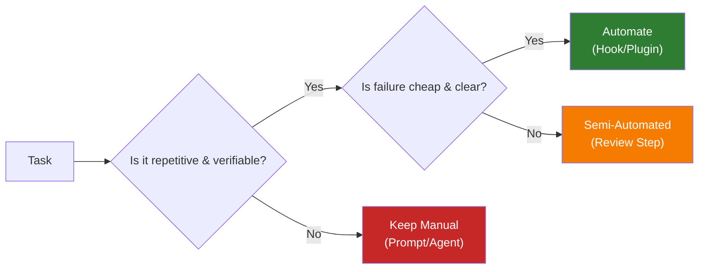

# Hooks and Automation

> **Harness role**: This module adds internal guardrails and repeatable automation behavior to the harness.

This module covers automation boundaries, with hooks understood through the official plugins framing. The goal is to establish safe guardrails for OpenCode without creating fragile, invisible rules.

---

## 🧭 Who this module is for

Use this module if:
- you want OpenCode to run checks automatically (e.g., before creating a commit)
- you want to enforce code formatting or linting without asking every time
- you want to understand the boundary between manual and automated workflows

---

## ⏱️ What you can finish in 15 minutes

By the end of this module, you should be able to:
1. explain what an OpenCode hook is and when to use it
2. set boundaries around what should be automated vs. manual
3. audit your repository's readiness for hooks

---

## 🧠 The Automation Boundary

Automation is a multiplier: it scales good practices, but it also scales mistakes.

### Good Hook Candidates
- Running a linter before committing code
- Running type checks
- Formatting files upon save
- Checking for secrets before pushing

### Bad Hook Candidates
- Automatically merging PRs
- Running full end-to-end test suites (too slow for a hook)
- Deploying to production

---

## 🛠️ Hands-on Exercise: Defining Boundaries

Use the checklist to decide what should be automated in your project.

**Starter template path**:
- [`templates/AUTOMATION-BOUNDARY-CHECKLIST.md`](templates/AUTOMATION-BOUNDARY-CHECKLIST.md)

### Exercise Instructions:
1. Open the checklist.
2. For each task in your daily workflow (formatting, testing, committing, reviewing), map it to an automation boundary.
3. If a task passes the "Good Hook Candidate" criteria, plan to implement a hook for it.
4. If a task fails, document it in `AGENTS.md` as a manual process.

---

## 📋 Types of Hooks

While OpenCode continues to evolve its plugin system, hooks generally fall into these categories:

- **Pre-action hooks**: Run *before* OpenCode executes a tool (e.g., `git commit`). Use these to enforce quality gates (like running a linter).
- **Post-action hooks**: Run *after* an action completes. Use these for notifications or cleanup.

---

## 🔌 Plugins vs Hooks

If you are mapping this repo to the official OpenCode docs, the easiest safe rule is:

- **plugins** are the extension layer
- **hooks** are automation points that often live inside plugin-driven workflows

That means a hook is usually not the whole story by itself. A plugin can package hooks, custom tools, and stronger workflow behavior together.

If you want the broader capability map, including **oh-my-opencode**, read [../PLUGINS-AND-OH-MY-OPENCODE.md](../PLUGINS-AND-OH-MY-OPENCODE.md).

---

## ⏭️ Suggested next step

Hooks are powerful, but sometimes you need OpenCode to interact with external systems like GitHub, JIRA, or a database. That requires Model Context Protocol (MCP).
Proceed to [06 - Integrations and MCP](../06-integrations-and-mcp/README.md).
