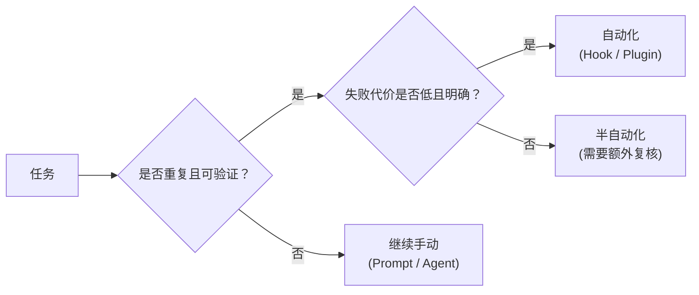

# Hooks and Automation（中文版）

**语言 / Language：** [简体中文](README.zh-CN.md) | [English](README.md)

这个模块讨论自动化边界：哪些内容适合自动化，哪些内容应该继续保留人工控制。
目标是在不制造脆弱隐性规则的前提下，为 OpenCode 建立安全护栏。

---

## 🧭 这个模块适合谁

如果你在想下面这些问题，就看这一章：

- 你想让 OpenCode 自动运行某些检查
- 你想不必每次都手动要求格式化或验证
- 你想理解手动流程和自动化流程之间的边界

---

## ⏱️ 15 分钟内你能完成什么

学完之后，你应该能：

1. 解释什么是 OpenCode hook，以及什么时候值得使用
2. 划清“应该自动化”和“应该手动处理”的边界
3. 审查你的仓库是否已经具备使用 hook 的准备度

---

## 🧠 自动化边界

自动化会放大好习惯，但也会放大坏决定。

### 适合做 Hook 的候选项

- 提交前运行 linter
- 运行类型检查
- 保存时格式化文件
- 推送前检查 secrets

### 不适合做 Hook 的候选项

- 自动合并 PR
- 跑完整端到端测试套件
- 自动部署生产环境

---

## 🛠️ 动手练习：定义边界

使用清单来判断项目里哪些内容适合自动化。

**起步模板路径：**

- [`templates/AUTOMATION-BOUNDARY-CHECKLIST.md`](templates/AUTOMATION-BOUNDARY-CHECKLIST.md)（英文模板）

### 练习步骤

1. 打开这份检查清单
2. 把你日常工作里的格式化、测试、提交、评审等任务映射到自动化边界上
3. 如果一个任务满足“适合做 Hook”的标准，就为它规划自动化方案
4. 如果不满足，就把它写成明确的人工流程

---

## 📋 Hook 的类型

虽然 OpenCode 的插件与自动化系统还在持续演进，但可以先把 hook 理解成两类：

- **Pre-action hooks**：在执行工具之前运行，用来做质量门槛
- **Post-action hooks**：在动作完成后运行，用来做通知或收尾

---

## ⏭️ 建议的下一步

自动化很重要，但有时你还需要 OpenCode 连接外部系统，例如 GitHub、JIRA 或数据库。那就会进入 MCP 的范围。

继续看 [06 - Integrations and MCP](../06-integrations-and-mcp/README.zh-CN.md)。
