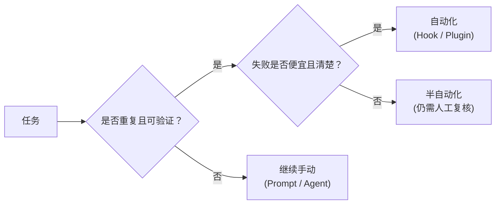

# Hooks and Automation

> **Harness 职责**：这个模块为 harness 增加内部护栏和可重复自动化行为。

这个模块讨论自动化边界，并通过官方 plugins 语境来理解 hooks：什么适合自动化，什么应该继续保留人工控制。

---

## 为什么这很重要

自动化会放大你的判断。
如果边界选对了，它能降低重复劳动、提前发现错误；如果边界选错了，它会更快地把混乱扩散出去。

这个模块的重点，是选择真正有利于 harness 的自动化边界。

---

## 🧭 这个模块适合谁

如果你在想这些问题，就读这一章：
- 想让 OpenCode 自动执行某些检查
- 想把重复规则固化，而不是每次重说
- 在 docs-first repo 里，不知道什么该自动化、什么该继续手动

---

## ⏱️ 15 分钟内你能完成什么

读完之后，你应该能：
1. 解释 OpenCode hook 是什么、什么时候值得用
2. 定义什么该手动、什么该自动化
3. 在不发明 tooling 的前提下审查一个 repo 的 automation readiness

---

## 这个模块假设什么，不假设什么

这个模块假设：
- 某些任务已经重复到值得考虑自动化
- repo 已经有基础 context 和 execution contract

这个模块不假设：
- 你的 repo 已经配置好了 hooks
- 你的 repo 已经有 test 或 lint 命令
- 自动化永远优于人工检查

---

## 🧠 自动化边界

自动化是放大器：它会放大好习惯，也会放大坏判断。

---

## Demo case：给这个 docs-first repo 分类重复检查

### Situation
这个仓库没有 verified package manager，也没有 test suite，但它确实有很多重复的文档完整性检查。

### Goal
判断哪些检查适合进自动化边界，哪些应该继续手动。

### Candidate checks
- markdown link validation
- 根导航是否同步更新
- 未验证命令是否仍然写成 `TBD`
- docs 里是否出现 secret
- 中英文导航是否漂移

### Better question
这些检查中，哪些是：
- repetitive？
- verifiable？
- failure cheap and clear？
- dangerous if automated blindly？

---

## 🛠️ Step-by-step workflow

1. **列出重复任务**
2. **分 3 个桶**
   - automate now
   - keep manual
   - candidate only
3. **自动化前先要证据**
   - 命令不存在，就不能诚实地围绕它做自动化
4. **优先自动化便宜、确定性的检查**
5. **主观或高代价流程继续保留人工 review**
6. **把边界文档化，写进 repo**

---

## docs-first repo 里好的候选项

- markdown link check
- 根导航更新检查
- secret 暴露检查
- 不要把未验证命令写成 verified 的检查

## docs-first repo 里坏的候选项

- 自动合并内容改动
- 自动发布外部声明
- 假装跑并不存在的 tests / builds

---

## 📋 Hook 的类型

在官方 plugin 语境下，可以先把 hook 理解成两类：
- **Pre-action hooks**：动作前运行
- **Post-action hooks**：动作后运行

---

## 🔌 Plugins 和 Hooks 的关系

最容易记住的规则是：
- **plugins** 是扩展层
- **hooks** 往往是扩展层里的自动化触发点

也就是说，hook 通常不是完整故事本身。一个 plugin 可以同时打包 hooks、自定义工具和更强工作流行为。

如果你想把这张能力地图连同 **oh-my-opencode** 一起看清楚，请读 [../PLUGINS-AND-OH-MY-OPENCODE.zh-CN.md](../PLUGINS-AND-OH-MY-OPENCODE.zh-CN.md)。

---

## 常见失败模式与修复

### 失败模式 1：自动化一个依赖未验证假设的任务
修复：退回 manual，或标成 candidate only。

### 失败模式 2：把重要判断藏在不可见自动化后面
修复：保留 human review。

### 失败模式 3：围绕不存在的命令构建自动化
修复：继续写成 `TBD`，并把缺失文档化。

---

## Starter asset

使用：
- [`templates/AUTOMATION-BOUNDARY-CHECKLIST.md`](templates/AUTOMATION-BOUNDARY-CHECKLIST.md)

---

## Reader outcome

学完这个模块后，你应该能把重复工作分成 safe automation、manual review 和 candidate-only 三类，而不发明 repo tooling。

---

## ⏭️ 建议下一步

继续看 [06 - Integrations and MCP](../06-integrations-and-mcp/README.zh-CN.md)。
