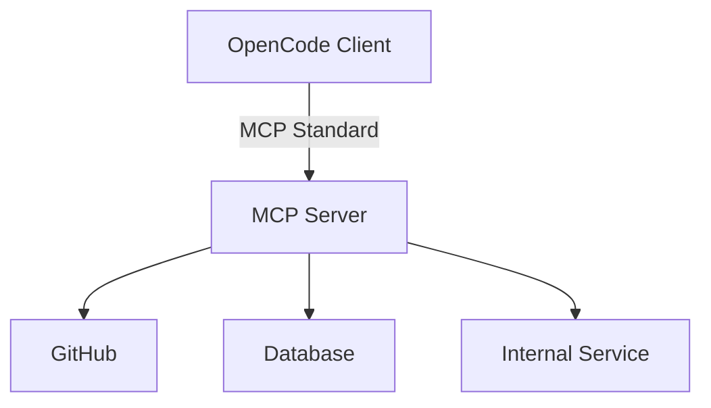

# Integrations and MCP

> **Harness role**: This module expands the harness beyond the local repo by connecting external systems safely.

This module explains how to safely connect OpenCode to external tools and data sources using the Model Context Protocol (MCP). It focuses on security, documentation, and managing secrets.

---

## Why this matters

A local harness can only act on what the repo and local tools expose.
As soon as you want GitHub, databases, ticket systems, or internal APIs, you need a controlled external capability layer.

This module is about adding that layer without leaking secrets or pretending integrations are simpler than they are.

---

## 🧭 Who this module is for

Use this module if:
- you want OpenCode to access external systems
- you need to document integrations for your team without exposing secrets
- you are deciding whether MCP is the right abstraction

---

## ⏱️ What you can finish in 15 minutes

By the end of this module, you should be able to:
1. explain what MCP is and why it exists
2. document a local integration safely
3. decide whether a problem needs built-in tools, plugins, or MCP

---

## What this module assumes, and does not assume

This module assumes:
- you understand the local repo harness already
- external systems are starting to matter

This module does **not** assume:
- a specific MCP server is already installed
- secrets can be committed anywhere in the repo
- destructive external actions should run without human confirmation

---

## 🧠 What MCP is for

The Model Context Protocol is the external capability bridge.
It is appropriate when OpenCode needs access to something outside the local tool surface.

---

## Demo case: document a safe GitHub integration without leaking secrets

### Situation
Your team wants OpenCode to inspect pull requests and issue metadata through an MCP server.

### Goal
Produce a shareable integration note that explains setup requirements without exposing real credentials.

### Artifacts in play
- [`templates/LOCAL-INTEGRATION-NOTES.md`](templates/LOCAL-INTEGRATION-NOTES.md)
- local environment variable names
- required permissions and safety boundaries

### Desired result
A teammate can configure the same integration locally without you ever committing a token.

---

## 🛠️ Step-by-step workflow

1. **Name the external system**
   - for example: GitHub
2. **State why MCP is needed**
   - what external capability is missing from local tools?
3. **Record only the setup envelope**
   - server name
   - env var names
   - required scopes or permissions
4. **Document the safety boundary**
   - read-only?
   - write-capable?
   - requires human confirmation?
5. **Do not store the credential value**
   - only document names and local setup expectations
6. **Share the note, not the secret**
   - the artifact belongs in docs
   - the secret belongs in a local environment

---

## 🔀 MCP vs Plugins vs Built-in Tools

Use this quick rule:

- use **built-in tools** when the local OpenCode tool surface already solves the problem
- use **plugins** when you want to extend OpenCode itself with stronger internal capability or automation behavior
- use **MCP** when OpenCode needs access to systems outside that local tool surface

If you want a beginner-friendly capability map, including where **oh-my-opencode** fits, read [../PLUGINS-AND-OH-MY-OPENCODE.md](../PLUGINS-AND-OH-MY-OPENCODE.md).

---

## 🛡️ Security boundaries

When integrating OpenCode with external tools:
1. **Never commit secrets**
2. **Use environment variables or local config**
3. **Prefer least privilege**
4. **Require confirmation for destructive actions**

---

## Failure modes and recovery

### Failure mode 1: documenting the token instead of the setup shape
Recovery: remove the value, keep only env var names and scope notes.

### Failure mode 2: giving the MCP layer more privilege than it needs
Recovery: reduce permissions before expanding workflow power.

### Failure mode 3: treating MCP as the answer to every integration problem
Recovery: first ask whether built-in tools or a plugin layer already solve it.

---

## Starter asset

Use:
- [`templates/LOCAL-INTEGRATION-NOTES.md`](templates/LOCAL-INTEGRATION-NOTES.md)

---

## Reader outcome

After this module, you should be able to document one safe external integration in a way the team can reuse without leaking secrets or overstating capability.

---

## ⏭️ Suggested next step

Continue to [07 - Team Workflows](../07-team-workflows/README.md) to make these harness decisions durable across multiple operators.
