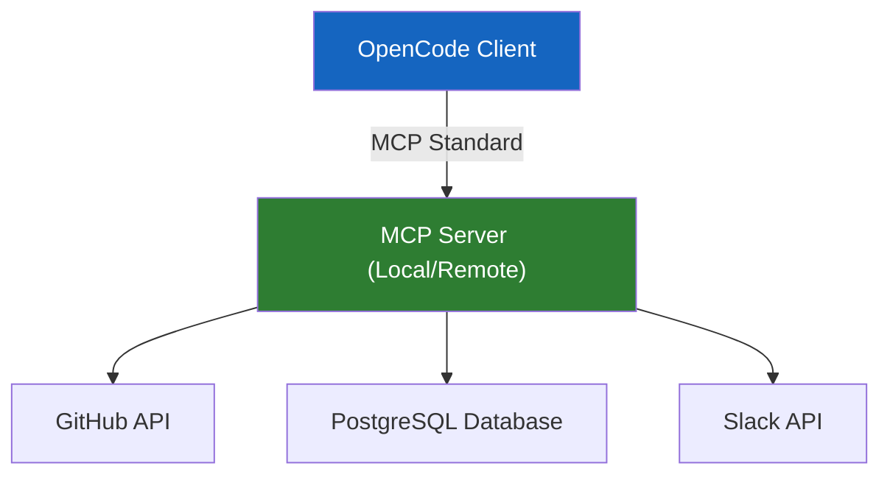

# Integrations and MCP

This module explains how to safely connect OpenCode to external tools and data sources using the Model Context Protocol (MCP). It focuses on security, documentation, and managing secrets.

---

## 🧭 Who this module is for

Use this module if:
- you want OpenCode to access your GitHub repositories, Slack channels, or local databases
- you are confused about how to manage API keys and secrets securely
- you need to document integrations for your team without exposing sensitive data

---

## ⏱️ What you can finish in 15 minutes

By the end of this module, you should be able to:
1. explain what MCP is and why it's better than hardcoded scripts
2. document a local integration safely
3. understand the security boundaries of providing an LLM access to external tools

---

## 🧠 What is MCP?

The Model Context Protocol (MCP) is an open standard that allows AI models to securely connect to external tools and data sources. Instead of writing custom scripts for every API, you run an MCP server, and OpenCode communicates with it.

### Why use MCP?
- **Security**: The MCP server handles the API keys; OpenCode just asks for data.
- **Standardization**: Write an MCP server once, use it with multiple AI tools.
- **Simplicity**: No need to teach the LLM how to format cURL requests.

---

## 🛡️ Security Boundaries

When integrating OpenCode with external tools:
1. **Never commit secrets**: Do not put API keys in `AGENTS.md` or any version-controlled file.
2. **Use environment variables**: Store secrets in a local `.env` or specific config files (like `~/.openclaw/openclaw.json`).
3. **Principle of least privilege**: Give the MCP server a token with only the permissions it needs (e.g., read-only access to a database).
4. **Interactive consent**: Ensure destructive actions (like dropping a table or pushing to main) require user confirmation.

---

## 🛠️ Hands-on Exercise: Documenting Integrations

When you set up an MCP server for your team, you need to document how to use it without sharing the actual keys.

**Starter template path**:
- [`templates/LOCAL-INTEGRATION-NOTES.md`](templates/LOCAL-INTEGRATION-NOTES.md)

### Exercise Instructions:
1. Open the integration notes template.
2. Pick an MCP server you plan to use (e.g., `@modelcontextprotocol/server-github`).
3. Fill out the template, specifying the required environment variables (e.g., `GITHUB_PERSONAL_ACCESS_TOKEN`), but do **not** provide the actual token.
4. Document the specific tools or resources this MCP server provides (e.g., `github_list_pull_requests`).
5. Share this document with your team so they know how to configure their local environments.

---

## ⏭️ Suggested next step

Once your tools, context, and integrations are set up, you need to ensure your entire team can use them effectively.
Proceed to [07 - Team Workflows](../07-team-workflows/README.md).
