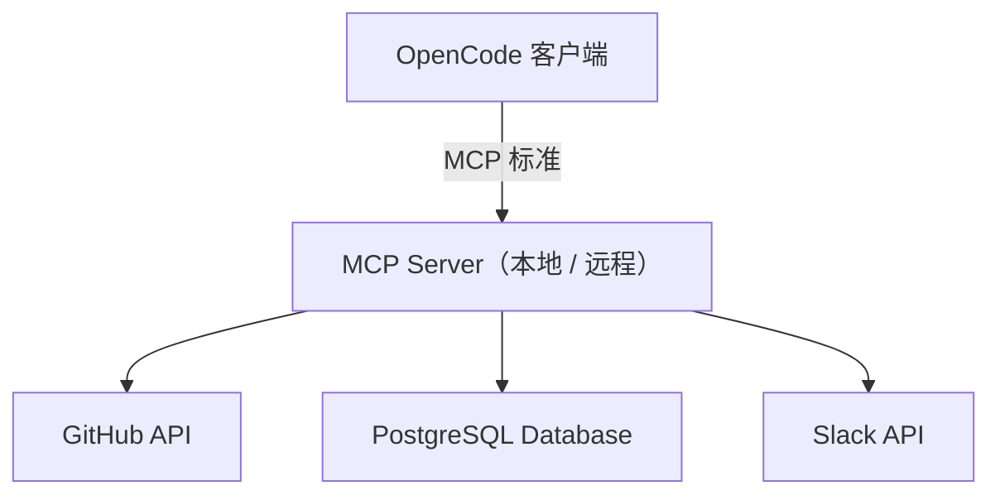

# Integrations and MCP（中文版）

> **Harness 职责**：这个模块安全地把 harness 从本地仓库扩展到外部系统。

**语言 / Language：** [简体中文](README.zh-CN.md) | [English](README.md)

这个模块解释如何通过 Model Context Protocol（MCP）把 OpenCode 安全地连接到外部工具和数据源。
重点是安全边界、文档化方式，以及 secrets 的管理。

---

## 🧭 这个模块适合谁

如果你需要下面这些能力，就从这里开始：

- 让 OpenCode 访问 GitHub、Slack 或本地数据库
- 想弄明白 API key 和 secrets 应该怎么安全管理
- 想为团队记录集成方式，但又不暴露敏感信息

---

## ⏱️ 15 分钟内你能完成什么

读完之后，你应该能：

1. 解释什么是 MCP，以及它为什么比硬编码脚本更合适
2. 用安全方式记录一个本地集成
3. 理解“让 LLM 访问外部工具”这件事的安全边界

---

## 🧠 MCP 是什么

Model Context Protocol（MCP）是一个开放标准，用来让 AI 模型安全地连接外部工具和数据源。你不需要为每个 API 都手写一套脚本，而是通过 MCP server 暴露能力，OpenCode 再去和它通信。

### 为什么用 MCP

- **安全性**：真正持有密钥的是 MCP server，不是文档本身
- **标准化**：写一次 server，就可以被多种 AI 工具复用
- **简单性**：不用把底层 API 调用细节硬塞给模型

---

## 🔀 MCP、Plugins、内建 Tools 怎么区分

可以用这个快速规则：

- 如果内建工具已经够用，就先用 **built-in tools**
- 如果你要扩展 OpenCode 本身的内部能力或自动化行为，就看 **plugins**
- 如果你要让 OpenCode 接本地工具面之外的外部系统，就看 **MCP**

如果你想把这张能力地图连同 **oh-my-opencode** 一起理解，请读 [../PLUGINS-AND-OH-MY-OPENCODE.zh-CN.md](../PLUGINS-AND-OH-MY-OPENCODE.zh-CN.md)。

---

## 🛡️ 安全边界

当你把 OpenCode 连到外部工具时：

1. **不要提交 secrets**：API key 不应该出现在 `AGENTS.md` 或任何版本控制文件中
2. **用环境变量**：把密钥放到本地 `.env` 或专用配置文件里
3. **最小权限原则**：只给 MCP server 需要的最小权限
4. **高风险动作必须可确认**：例如删库、推送主分支，都应该有人确认

---

## 🛠️ 动手练习：记录集成方式

为团队设置 MCP server 时，一个常见需求是：把接入方式写清楚，但又不能把密钥写进仓库。

**起步模板路径：**

- [`templates/LOCAL-INTEGRATION-NOTES.md`](templates/LOCAL-INTEGRATION-NOTES.md)（英文模板）

### 练习步骤

1. 打开 integration notes 模板
2. 选一个你打算使用的 MCP server
3. 只写需要的环境变量名，不写真实值
4. 记录这个 MCP server 提供哪些工具或资源
5. 把这份文档交给团队，让每个人能在本地完成配置

---

## ⏭️ 建议的下一步

当工具、上下文和集成都开始成型时，下一步就是确保整个团队都能一致地使用它们。

继续看 [07 - Team Workflows](../07-team-workflows/README.zh-CN.md)。
