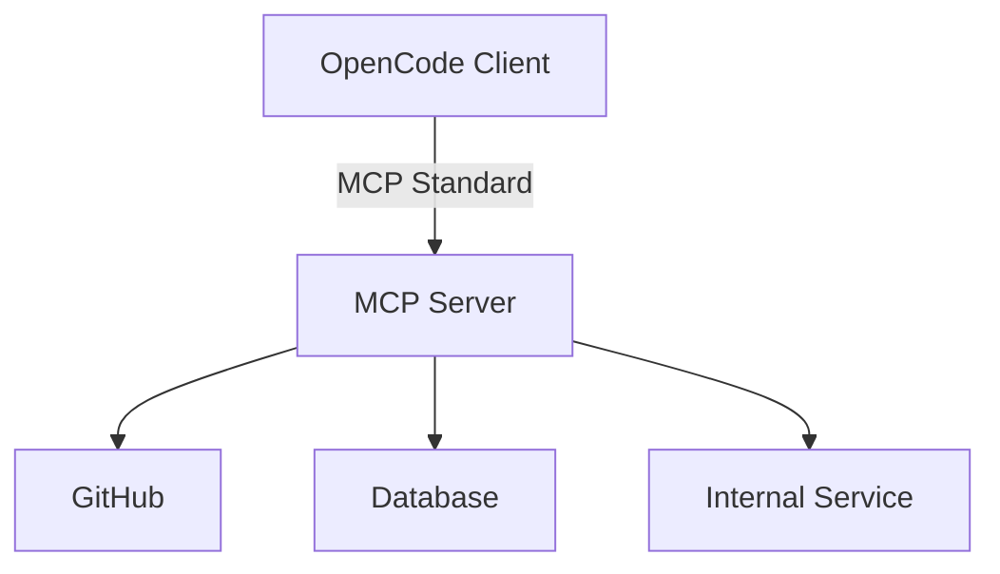

# Integrations and MCP

> **Harness 职责**：这个模块安全地把 harness 从本地仓库扩展到外部系统。

这个模块解释如何通过 Model Context Protocol（MCP）把 OpenCode 安全地连接到外部工具和数据源。
重点是安全边界、文档化方式，以及 secrets 管理。

---

## 为什么这很重要

本地 harness 只能处理 repo 和本地工具已经暴露出来的能力。
一旦你想接 GitHub、数据库、工单系统或内部 API，就必须增加一个受控的外部能力层。

这个模块的重点，是在不泄露 secrets、不简化风险的前提下，把这个能力层加进去。

---

## 🧭 这个模块适合谁

如果你需要下面这些能力，就从这里开始：
- 让 OpenCode 访问外部系统
- 想把集成方式写清楚给团队，但又不暴露敏感信息
- 想判断 MCP 是不是真正合适的抽象

---

## ⏱️ 15 分钟内你能完成什么

读完之后，你应该能：
1. 解释什么是 MCP，以及它为什么存在
2. 用安全方式记录一个本地集成
3. 判断一个问题应该用 built-in tools、plugins 还是 MCP

---

## 这个模块假设什么，不假设什么

这个模块假设：
- 你已经理解本地 repo harness
- 外部系统开始对工作流变得重要

这个模块不假设：
- 已经安装了某个具体 MCP server
- secrets 可以提交进 repo
- 高风险外部操作不需要人工确认

---

## 🧠 MCP 是干什么的

MCP 是外部能力桥梁。
当 OpenCode 需要访问本地工具面之外的系统时，MCP 就是更合适的抽象。

---

## Demo case：记录一个安全的 GitHub 集成，而不泄露 token

### Situation
团队希望 OpenCode 通过 MCP server 去读取 PR 和 issue 元数据。

### Goal
写出一份团队可复用的集成说明，但不泄露任何真实凭证。

### Artifacts in play
- [`templates/LOCAL-INTEGRATION-NOTES.md`](templates/LOCAL-INTEGRATION-NOTES.md)
- 本地环境变量名
- 权限范围与风险说明

### Desired result
另一个 teammate 可以照说明在本地配置好同样的集成，而你不需要把 token 提交进仓库。

---

## 🛠️ Step-by-step workflow

1. **先命名外部系统**
2. **说明为什么这里需要 MCP**
   - 本地 tools 缺了什么能力？
3. **只记录 setup envelope**
   - server 名称
   - env var 名称
   - 权限范围
4. **写清安全边界**
   - read-only？
   - write-capable？
   - 是否需要人工确认？
5. **不要记录 secret value**
6. **共享说明，不共享凭证**

---

## 🔀 MCP、Plugins、内建 Tools 怎么区分

可以用这个快速规则：
- 如果内建工具已经够用，就先用 **built-in tools**
- 如果你要扩展 OpenCode 本身的内部能力或自动化行为，就看 **plugins**
- 如果你要让 OpenCode 接本地工具面之外的外部系统，就看 **MCP**

如果你想把这张能力地图连同 **oh-my-opencode** 一起理解，请读 [../PLUGINS-AND-OH-MY-OPENCODE.zh-CN.md](../PLUGINS-AND-OH-MY-OPENCODE.zh-CN.md)。

---

## 🛡️ 安全边界

当你把 OpenCode 接到外部系统时：
1. **不要提交 secrets**
2. **用环境变量或本地配置**
3. **最小权限原则**
4. **高风险动作必须人工确认**

---

## 常见失败模式与修复

### 失败模式 1：把 token 写进文档，而不是写 setup 形状
修复：删掉 value，只保留 env var 名称和权限说明。

### 失败模式 2：给 MCP 层过大的权限
修复：先收窄权限，再扩展工作流能力。

### 失败模式 3：把 MCP 当成所有集成问题的默认答案
修复：先判断 built-in tools 或 plugin layer 是否已经够用。

---

## Starter asset

使用：
- [`templates/LOCAL-INTEGRATION-NOTES.md`](templates/LOCAL-INTEGRATION-NOTES.md)

---

## Reader outcome

学完这个模块后，你应该能记录一个安全的外部集成，让团队复用，而不泄露 secrets 或夸大能力。

---

## ⏭️ 建议下一步

继续看 [07 - Team Workflows](../07-team-workflows/README.zh-CN.md)。
