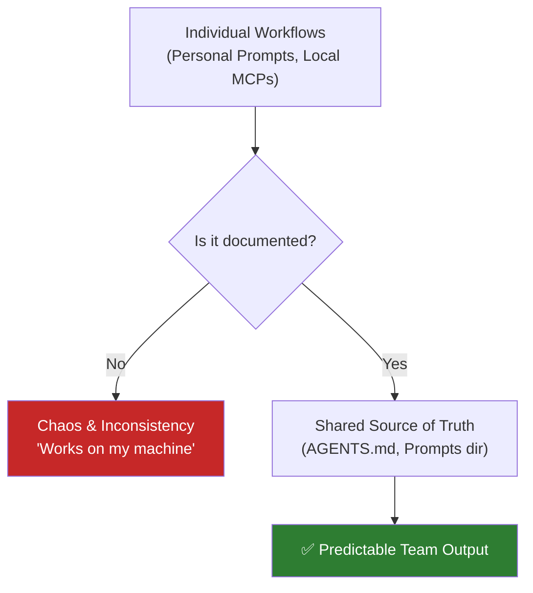

# Team Workflows

This module covers onboarding, shared conventions, and keeping team guidance aligned with repository reality. It is designed to help teams adopt OpenCode without chaos.

---

## 🧭 Who this module is for

Use this module if:
- you are introducing OpenCode to a team of developers
- you want to avoid everyone using different prompts, tools, and workflows
- you need to ensure new contributors can start without guessing

---

## ⏱️ What you can finish in 15 minutes

By the end of this module, you should be able to:
1. define a shared "source of truth" for your team's OpenCode usage
2. audit your repository's onboarding readiness
3. prevent "works on my machine" AI workflows

---

## 🧠 The Shared Source of Truth

When an individual uses OpenCode, they build personal habits. When a team uses OpenCode, those habits need to be encoded in the repository.

### What belongs in the repository:
- `AGENTS.md`: The core rules and verified facts.
- `prompts/`: Shared `.md` templates (like `PLAN-REQUEST.md`).
- `skills/`: Reusable OpenCode skills (`SKILL.md`).
- `docs/integrations.md`: How to set up required MCP servers.

### What stays local:
- `.env` files or `openclaw.json` (API keys, personal tokens).
- Personal preference configurations.

---

## 🛠️ Hands-on Exercise: Team Onboarding

The test of a good team workflow is how quickly a new contributor can become productive.

**Starter template path**:
- [`templates/TEAM-ONBOARDING-CHECKLIST.md`](templates/TEAM-ONBOARDING-CHECKLIST.md)

### Exercise Instructions:
1. Open the checklist.
2. Pretend you are a new developer joining the project today.
3. Attempt to complete the onboarding steps using *only* the documentation in the repository.
4. If you have to ask a teammate or look at a personal file, the repository is missing a source of truth.
5. Update `AGENTS.md` or create a missing template to close the gap.

---

## 🔄 Keeping Guidance Aligned

Team documentation rots quickly. Make it a habit to update `AGENTS.md` during Pull Request reviews. If a PR introduces a new testing framework, the PR must also update `AGENTS.md`.

---

## ⏭️ Suggested next step

Once your team is aligned, you can start building robust templates for specific tech stacks.
Proceed to [08 - Cross-Stack Templates](../08-cross-stack-templates/README.md).
