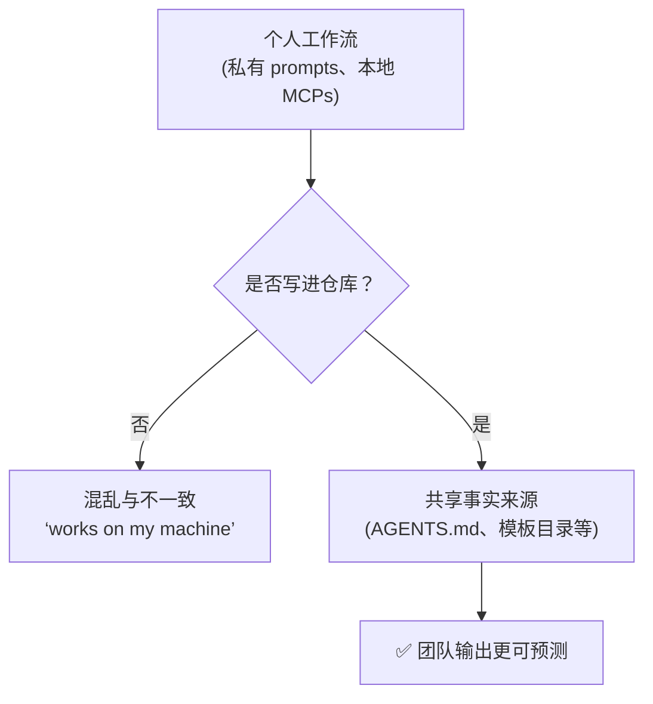

# Team Workflows（中文版）

**语言 / Language：** [简体中文](README.zh-CN.md) | [English](README.md)

这个模块讨论团队 onboarding、共享约定，以及如何让团队文档始终和仓库现实保持一致。
目标是帮助团队使用 OpenCode，而不是让每个人都靠自己的私有习惯各自为战。

---

## 🧭 这个模块适合谁

如果你在做这些事，就读这一章：

- 你准备把 OpenCode 引入团队
- 你不想让每个人都用不一样的 prompts、工具和流程
- 你需要确保新同事可以在不猜的情况下开始工作

---

## ⏱️ 15 分钟内你能完成什么

读完之后，你应该能：

1. 定义团队共享的“事实来源”
2. 审查你的仓库 onboarding 是否已经足够清楚
3. 避免“works on my machine”式的 AI 工作流

---

## 🧠 团队共享的事实来源

个人使用 OpenCode 时，很多习惯会停留在脑子里；团队使用时，这些习惯必须被写进仓库。

### 哪些内容应该进仓库

- `AGENTS.md`：核心规则和已验证事实
- 共享的 `.md` 模板
- 可复用的 OpenCode skills
- 关于 MCP server 的集成说明

### 哪些内容应该留在本地

- `.env`、个人 token、私密密钥
- 个人偏好配置

---

## 🛠️ 动手练习：团队 onboarding

团队工作流好不好，最直接的检验方式就是：一个新贡献者能不能只靠仓库文档就开始工作。

**起步模板路径：**

- [`templates/TEAM-ONBOARDING-CHECKLIST.md`](templates/TEAM-ONBOARDING-CHECKLIST.md)（英文模板）

### 练习步骤

1. 打开这份检查清单
2. 假设你今天是第一次加入这个项目
3. 试着只依赖仓库文档完成 onboarding
4. 如果你不得不问同事或查看某个私人文件，说明仓库里缺少共享事实来源
5. 用 `AGENTS.md` 或新的模板把这个缺口补上

---

## 🔄 让团队指导持续对齐

团队文档很容易过期。一个很有价值的习惯是：每当 PR 引入新规则、新工具或新流程时，同时更新 `AGENTS.md` 和相关文档。

---

## ⏭️ 建议的下一步

当团队协作层已经比较稳了，你就可以开始思考：哪些内容是跨技术栈通用的，哪些又应该等到真实 stack 决定后再写。

继续看 [08 - Cross-Stack Templates](../08-cross-stack-templates/README.zh-CN.md)。
