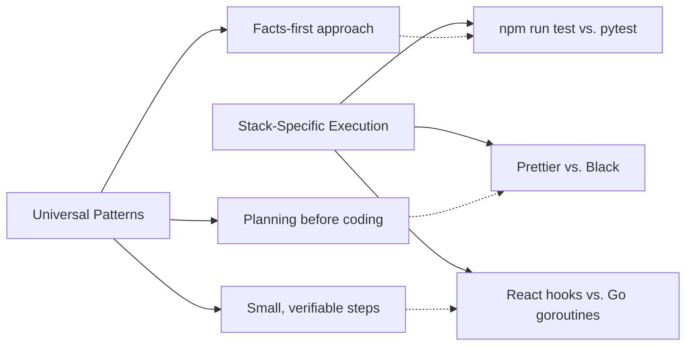

# Cross-Stack Templates

This module explains what stays universal across projects and when stack-specific starter kits are justified. It emphasizes the importance of verified commands before creating stack-specific documentation.

---

## 🧭 Who this module is for

Use this module if:
- you work across multiple languages or frameworks
- you want to know which OpenCode patterns apply everywhere
- you are tempted to create a massive boilerplate repository but aren't sure if it's worth it

---

## ⏱️ What you can finish in 15 minutes

By the end of this module, you should be able to:
1. separate universal OpenCode practices from stack-specific implementation details
2. audit a project to see if it's ready for a stack-specific starter kit
3. understand why verified commands must precede stack-specific docs

---

## 🧠 Universal vs. Stack-Specific

Good AI workflows have a universal core, but execution depends entirely on the stack.

### Universal Patterns (Apply Everywhere):
- Using `AGENTS.md` to ground the AI.
- Using `explore` and `librarian` agents to gather context.
- Writing structured prompts (`PLAN-REQUEST.md`).
- Documenting MCP integrations.

### Stack-Specific Details (Vary by Project):
- The exact test command (`npm test`, `cargo test`, `pytest`).
- The linting rules and formatters.
- The build process.

> **Core Rule**: Do not write stack-specific documentation until the commands actually exist and are verified in the repository.

---

## 🛠️ Hands-on Exercise: Starter Kit Readiness

Before you build a "React + Node + OpenCode Starter Kit," make sure the foundation is solid.

**Starter template path**:
- [`templates/STACK-STARTER-READINESS-CHECKLIST.md`](templates/STACK-STARTER-READINESS-CHECKLIST.md)

### Exercise Instructions:
1. Pick a stack you use frequently (e.g., Python/FastAPI, TypeScript/Next.js).
2. Open the readiness checklist.
3. Check if your repository actually has working commands for linting, testing, and building. If a human can't run them locally, OpenCode can't run them reliably either.
4. Only when the checklist is fully verified should you start baking those specific commands into your prompt templates or custom skills.

---

## ⏭️ Suggested next step

Once your universal and stack-specific foundations are solid, you can scale up your workflows.
Proceed to [09 - Advanced Workflows](../09-advanced-workflows/README.md).
