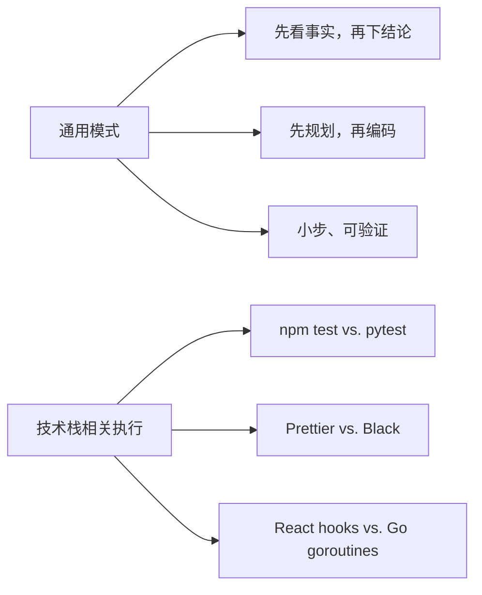

# Cross-Stack Templates（中文版）

> **Harness 职责**：这个模块帮助你让 harness 跨技术栈迁移，而不发明不存在的工具链。

**语言 / Language：** [简体中文](README.zh-CN.md) | [English](README.md)

这个模块讨论：哪些 OpenCode 实践是跨项目通用的，什么时候才值得做技术栈专用 starter kit。
重点是先确认命令真实存在，再去写 stack-specific 文档。

---

## 🧭 这个模块适合谁

如果下面这些情况符合你，这章会很有帮助：

- 你在多个语言或框架之间工作
- 你想知道哪些 OpenCode 模式在任何项目里都成立
- 你正想做一个“大而全”的 boilerplate 仓库，但不确定是否值得

---

## ⏱️ 15 分钟内你能完成什么

读完之后，你应该能：

1. 区分通用 OpenCode 实践和 stack-specific 细节
2. 审查一个项目是否已经准备好做技术栈专用 starter
3. 理解为什么必须先有已验证命令，再写 stack-specific 文档

---

## 🧠 通用内容 vs. 技术栈内容

好的 AI 工作流有一个通用核心，但真正落地时仍然高度依赖项目技术栈。

### 通用模式（到处都适用）

- 用 `AGENTS.md` 把 AI 锚定在现实里
- 用 `explore`、`librarian` 等能力先做上下文收集
- 使用结构化请求模板
- 记录 MCP 集成方式

### 技术栈细节（会因项目而变）

- 具体测试命令是什么
- 用什么 lint / formatter
- 构建流程是什么

> **核心规则**：在命令真实存在并被验证之前，不要写 stack-specific 文档。

---

## 🛠️ 动手练习：Starter Kit Readiness

在你开始写 “React + Node + OpenCode Starter Kit” 这类东西之前，先确认基础是否真的稳固。

**起步模板路径：**

- [`templates/STACK-STARTER-READINESS-CHECKLIST.md`](templates/STACK-STARTER-READINESS-CHECKLIST.md)（英文模板）

### 练习步骤

1. 选一个你常用的技术栈
2. 打开 readiness checklist
3. 检查仓库里是否真的有可运行的 lint / test / build 命令
4. 只有在这些条件被真实文件支持后，才把它们写进模板、prompt 或 skill

---

## ⏭️ 建议的下一步

当通用层和 stack-specific 边界都更清楚以后，就可以开始设计更复杂的多阶段流程。

继续看 [09 - Advanced Workflows](../09-advanced-workflows/README.zh-CN.md)。
