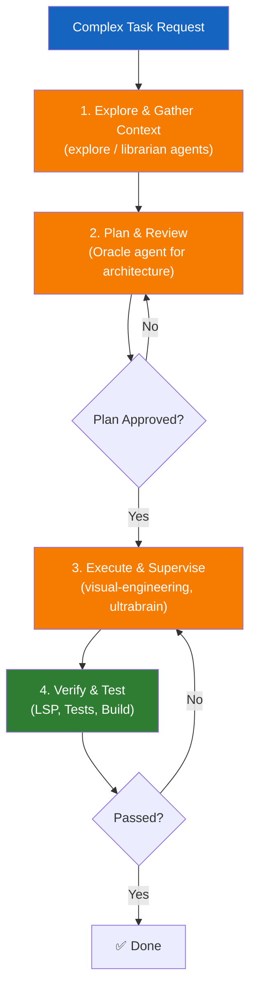

# Advanced Workflows

This module covers multi-step workflow design, review and validation points, and scaling repeated processes without losing control.

---

## 🧭 Who this module is for

Use this module if:
- you want to automate complex, multi-stage tasks (e.g., refactoring an entire module)
- you need OpenCode to coordinate multiple specialized agents
- you are tired of long context windows breaking your tasks

---

## ⏱️ What you can finish in 15 minutes

By the end of this module, you should be able to:
1. design a multi-step workflow with clear checkpoints
2. orchestrate OpenCode's agents (`explore`, `librarian`, `visual-engineering`, `oracle`)
3. audit a repeated process for scalability

---

## 🧠 Multi-Step Workflow Design

When a task requires more than a single file change, asking OpenCode to "just do it" usually fails. A robust workflow breaks the work into stages, verifying at each step.

### Key Concepts:
- **Parallel Context Gathering**: Fire 2-5 background agents (`explore`/`librarian`) before making a single edit.
- **The Planning Gate**: Never start implementation without a written plan for multi-step tasks.
- **Verification Loop**: Run `lsp_diagnostics`, tests, and builds after *every* change.

One more boundary matters in advanced workflows:

- if you need more internal extension behavior, think **plugins**
- if you need outside systems, think **MCP**
- if you need stronger community orchestration on top of OpenCode, study **oh-my-opencode**

---

## 🛠️ Hands-on Exercise: Scaling a Process

Before automating a massive workflow, check if it's actually ready to scale.

**Starter template path**:
- [`templates/ADVANCED-WORKFLOW-CHECKLIST.md`](templates/ADVANCED-WORKFLOW-CHECKLIST.md)

### Exercise Instructions:
1. Identify a complex process you want to automate (e.g., migrating from CSS modules to Tailwind).
2. Open the checklist.
3. Determine if the process has a clear "done" state, verifiable intermediate steps, and a deterministic outcome.
4. If it fails the checklist, break it down further until each sub-task passes.
5. Create a `todowrite` checklist or a `PLAN-REQUEST.md` specifically for this workflow.

---

## ⏭️ Suggested next step

To execute advanced workflows efficiently, you need to master the command line and terminal integration.
Proceed to [10 - CLI and Terminal Usage](../10-cli-and-terminal/README.md).
