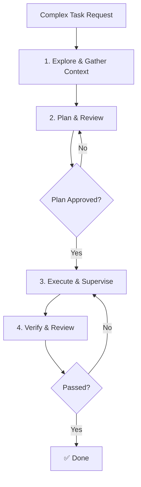

# Advanced Workflows

> **Harness role**: This module is about orchestrating complex, multi-step work without losing control or verification.

This module covers multi-step workflow design, review and validation points, and scaling repeated processes without losing control.

---

## Why this matters

A simple harness can handle small local changes.
A strong harness can coordinate exploration, planning, execution, and verification across a multi-step task without dissolving into chaos.

This module is about building that stronger harness.

---

## 🧭 Who this module is for

Use this module if:
- you want to automate complex, multi-stage tasks
- you need OpenCode to coordinate multiple specialized agents
- you are tired of long context windows breaking your work

---

## ⏱️ What you can finish in 15 minutes

By the end of this module, you should be able to:
1. design a multi-step workflow with explicit checkpoints
2. decide where planning and verification gates belong
3. use a repeatable orchestration pattern for complex docs-first work

---

## What this module assumes, and does not assume

This module assumes:
- the harness already has context, contracts, and routing logic
- the task is too large for a single-shot prompt

This module does **not** assume:
- CI exists
- every step can be automated
- the first plan is always correct

---

## 🧠 Multi-step workflow design

When a task requires more than a single file change, asking OpenCode to “just do it” usually fails.
A robust workflow breaks the work into stages, verifying at each step.

---

## Demo case: expand a thin module into a real harness playbook

### Situation
A module README has the right concepts, but only one short exercise and no worked demo.

### Goal
Rewrite it into a richer harness playbook without inventing tooling.

### Artifacts in play
- the module README
- related templates
- root README / roadmap / catalog
- link validation as the final check

### Desired result
The module now teaches a repeatable workflow, not just judgment vocabulary.

---

## 🛠️ Step-by-step workflow

1. **Explore the current state**
   - read the module
   - read related templates
   - inspect root navigation expectations
2. **Define the rewrite goal**
   - what failure should this module prevent?
   - what should the reader be able to do afterward?
3. **Set a planning gate**
   - outline sections before rewriting
4. **Rewrite with one demo case**
   - situation
   - goal
   - artifacts
   - steps
   - failure modes
5. **Verify the narrative**
   - does it still match repo reality?
   - does it imply fake tooling?
6. **Validate links and supporting references**
7. **Do one review pass focused on clarity, not style only**

---

## Key boundaries in advanced workflows

- if you need more internal extension behavior, think **plugins**
- if you need outside systems, think **MCP**
- if you need stronger community orchestration on top of OpenCode, study **oh-my-opencode**
- if the task still lacks a clear stop condition, go back to planning

---

## Failure modes and recovery

### Failure mode 1: starting execution before the plan is inspectable
Recovery: add a planning gate.

### Failure mode 2: skipping verification because the narrative sounds right
Recovery: verify links, file references, and claims explicitly.

### Failure mode 3: trying to automate a process that is not yet deterministic
Recovery: break it into smaller orchestrated pieces.

---

## Starter assets

Use:
- [`templates/ADVANCED-WORKFLOW-CHECKLIST.md`](templates/ADVANCED-WORKFLOW-CHECKLIST.md)
- [`templates/OMO-VIBE-CODING-KICKOFF.md`](templates/OMO-VIBE-CODING-KICKOFF.md)

---

## Reader outcome

After this module, you should be able to turn a large task into an orchestrated workflow with checkpoints, review gates, and verification loops.

---

## ⏭️ Suggested next step

Continue to [10 - CLI and Terminal Usage](../10-cli-and-terminal/README.md) to define the shell boundaries that keep advanced workflows safe.
