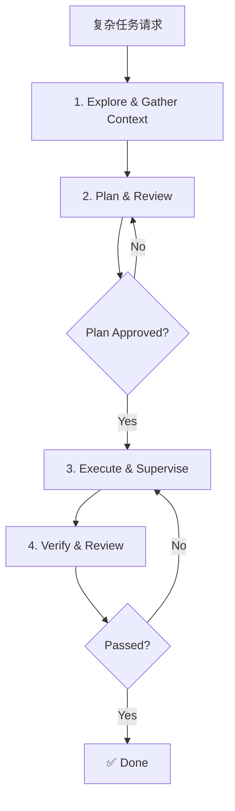

# Advanced Workflows

> **Harness 职责**：这个模块讨论如何编排复杂多阶段工作，同时不丢失控制和验证。

这个模块讨论多阶段工作流设计、评审和验证点，以及如何在不失控的前提下扩展重复流程。

---

## 为什么这很重要

简单 harness 能处理局部小改动。
强一些的 harness 必须能协调 exploration、planning、execution 和 verification，而不是一到复杂任务就散架。

这个模块就是为了建立这种更强的编排能力。

---

## 🧭 这个模块适合谁

如果你遇到这些问题，就读这一章：
- 想自动化一个复杂多阶段任务
- 需要 OpenCode 协调多个专业 agent
- 长上下文任务很容易失控

---

## ⏱️ 15 分钟内你能完成什么

读完之后，你应该能：
1. 设计带明确检查点的多阶段流程
2. 判断 planning gate 和 verification gate 应该放哪里
3. 用一个重复可用的编排模式处理 docs-first 复杂任务

---

## 这个模块假设什么，不假设什么

这个模块假设：
- harness 已经有 context、contracts 和 routing logic
- 任务已经大到不能靠单次 prompt 解决

这个模块不假设：
- CI 已经存在
- 每一步都能自动化
- 第一版 plan 一定正确

---

## 🧠 多阶段工作流设计

当一个任务不止是改一个文件时，让 OpenCode “直接去做” 往往会失败。
更稳的方法，是拆成阶段，并在每个阶段都设置检查点。

---

## Demo case：把一个薄弱模块 README 扩成真正的 harness playbook

### Situation
一个模块 README 概念是对的，但只有一个很短的 exercise，没有 worked demo。

### Goal
把它改写成 richer harness playbook，同时不发明 tooling。

### Artifacts in play
- 模块 README
- 相关 templates
- 根 README / roadmap / catalog
- 最后的 link validation

### Desired result
模块不只是教概念，而是能教一种可重复 workflow。

---

## 🛠️ Step-by-step workflow

1. **先看当前状态**
   - 读模块
   - 读相关模板
   - 看根导航希望它承担什么角色
2. **定义改写目标**
   - 这个模块要防止哪类失败？
   - 读者读完后应该会做什么？
3. **设置 planning gate**
4. **围绕一个 demo case 重写**
   - situation
   - goal
   - artifacts
   - steps
   - failure modes
5. **验证 narrative**
   - 有没有暗示 fake tooling？
   - 有没有超出 repo 现实？
6. **做 links / claims 验证**
7. **再做一轮 clarity review**

---

## 高级编排里的关键边界

- 需要更多内部扩展行为时，想 **plugins**
- 需要外部系统时，想 **MCP**
- 需要更强社区编排层时，想 **oh-my-opencode**
- 如果任务还没有清楚 stop condition，就先回 planning gate

---

## 常见失败模式与修复

### 失败模式 1：计划还没可审查，就直接进入执行
修复：先加 planning gate。

### 失败模式 2：因为 narrative 看起来对，就跳过验证
修复：显式验证 links、file references 和 claims。

### 失败模式 3：试图自动化一个还不够 deterministic 的流程
修复：先拆成更小、可编排的 pieces。

---

## Starter assets

使用：
- [`templates/ADVANCED-WORKFLOW-CHECKLIST.md`](templates/ADVANCED-WORKFLOW-CHECKLIST.md)
- [`templates/OMO-VIBE-CODING-KICKOFF.md`](templates/OMO-VIBE-CODING-KICKOFF.md)

---

## Reader outcome

学完这个模块后，你应该能把一个复杂任务拆成带 checkpoints、review gates 和 verification loops 的编排流程。

---

## ⏭️ 建议下一步

继续看 [10 - CLI and Terminal Usage](../10-cli-and-terminal/README.zh-CN.md)。
