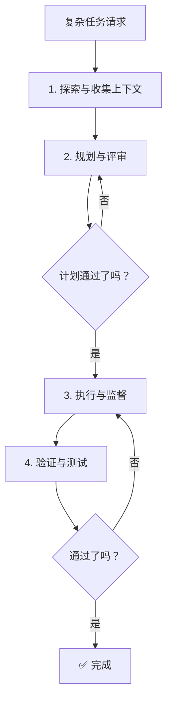

# Advanced Workflows（中文版）

> **Harness 职责**：这个模块讨论如何编排复杂多阶段工作，同时不丢失控制和验证。

**语言 / Language：** [简体中文](README.zh-CN.md) | [English](README.md)

这个模块讨论多阶段工作流设计、评审和验证点，以及如何在不失控的前提下扩展重复流程。

---

## 🧭 这个模块适合谁

如果你遇到这些问题，就读这一章：

- 你想自动化一个复杂的多阶段任务
- 你需要 OpenCode 协调多个专业代理
- 你发现长上下文任务很容易崩掉

---

## ⏱️ 15 分钟内你能完成什么

读完之后，你应该能：

1. 设计带明确检查点的多阶段流程
2. 理解如何编排 `explore`、`librarian`、`oracle` 等代理
3. 审查一个重复流程是否真的适合扩展

---

## 🧠 多阶段工作流设计

当一个任务不止是改一个文件时，让 OpenCode “直接去做” 往往会失败。更稳的方法，是把它拆成阶段，并且每个阶段都能验证。

### 关键概念

- **并行收集上下文**：先用后台代理把信息摸清楚
- **规划闸门**：多步骤任务不要跳过计划
- **验证循环**：每次改动之后都重新检查

---

## 🛠️ 动手练习：扩展一个流程

在你试图自动化一个庞大流程之前，先确认它是否真的已经适合扩展。

**起步模板路径：**

- [`templates/ADVANCED-WORKFLOW-CHECKLIST.md`](templates/ADVANCED-WORKFLOW-CHECKLIST.md)（英文模板）

### 练习步骤

1. 选一个你想扩展的复杂流程
2. 打开检查清单
3. 判断它是否有清晰完成态、可验证中间步骤和可重复结果
4. 如果没有，就先把流程继续拆细
5. 再考虑把它整理成 `todowrite` 清单或更正式的计划请求

---

## ⏭️ 建议的下一步

要把高级工作流真正跑稳，下一步就会进入命令行与终端边界。

继续看 [10 - CLI and Terminal Usage](../10-cli-and-terminal/README.zh-CN.md)。
