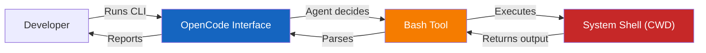

# CLI and Terminal Usage

> **Harness role**: This module defines execution boundaries between human intent, OpenCode, plugins, and the system shell.

This module covers truthful command documentation and terminal-facing workflow habits. It emphasizes aligning TUI/CLI wording with the official docs and knowing when command docs should stay `TBD`.

---

## 🧭 Who this module is for

Use this module if:
- you want to run OpenCode from the command line or terminal UI (TUI)
- you need to script OpenCode interactions in CI/CD or local bash scripts
- you want to understand how OpenCode executes shell commands on your behalf

---

## ⏱️ What you can finish in 15 minutes

By the end of this module, you should be able to:
1. understand the boundary between OpenCode's CLI and your system's shell
2. safely grant terminal access to agents
3. document CLI commands for your team truthfully

---

## 🧠 OpenCode in the Terminal

OpenCode can interact with your terminal in two ways:
1. **As an interface**: You run `opencode` (or your specific CLI binary) to chat.
2. **As an actor**: OpenCode runs `bash` tools to execute commands (e.g., `git status`, `npm install`).

### Safety and Boundaries
- OpenCode runs commands in the current working directory.
- Avoid using `cd <dir> && <command>`. Instead, specify the `workdir`.
- Destructive commands (like `git push --force`) require explicit user consent.
- Commands with interactive prompts (like `git rebase -i` or `vim`) will hang or fail unless handled properly (e.g., via `interactive_bash` in tmux).

Terminal use is also where people most often confuse built-in behavior, plugin behavior, and community workflow layers. If you need a cleaner mental model for that boundary, read [../PLUGINS-AND-OH-MY-OPENCODE.md](../PLUGINS-AND-OH-MY-OPENCODE.md).

---

## 🛠️ Hands-on Exercise: Documenting Verified Commands

A common mistake is documenting commands that don't exist yet, confusing both humans and AI agents.

### Exercise Instructions:
1. Open your project's `AGENTS.md` (or your stack-specific documentation).
2. Look at the commands section (Install, Lint, Test, Build).
3. Open your terminal and manually run each command exactly as written.
4. If a command fails (e.g., `npm run test` fails because there is no test script in `package.json`), **change the documentation to `TBD`**.
5. Do not invent commands. If the project uses `make build`, write `make build`. If it has no build step, write "No build command is currently verified."

> **Core Rule**: Terminal documentation must reflect reality, not aspiration.

---

## 🎉 Conclusion

You've completed the core OpenCode harness path. You now have a stronger map for grounding OpenCode in repo reality, using structured execution contracts, orchestrating agents, adding safe automation and MCP capability, and scaling the harness across your team.

For specific feature references, always check the [official OpenCode documentation](https://opencode.ai/docs/).

- [Back to the Learning Roadmap](../LEARNING-ROADMAP.md)
- [Browse the Catalog](../CATALOG.md)
