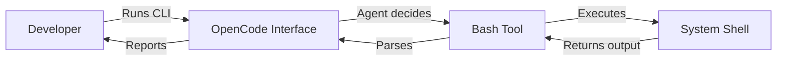

# CLI and Terminal Usage

> **Harness role**: This module defines execution boundaries between human intent, OpenCode, plugins, and the system shell.

This module covers truthful command documentation and terminal-facing workflow habits.

---

## Why this matters

The terminal is where a harness turns from documentation into action.
It is also where false claims become obvious fastest: invented commands fail, unsafe commands damage trust, and ambiguous shell boundaries create fragile workflows.

This module is about keeping command truth and execution boundaries honest.

---

## 🧭 Who this module is for

Use this module if:
- you want to run OpenCode from the CLI or terminal UI
- you need to script parts of your workflow
- you want truthful command documentation in a docs-first repo

---

## ⏱️ What you can finish in 15 minutes

By the end of this module, you should be able to:
1. explain the boundary between OpenCode and the system shell
2. audit a command section for truthfulness
3. document command absence as safely as command presence

---

## What this module assumes, and does not assume

This module assumes:
- terminal commands will eventually matter to the harness
- command docs are part of the system of record

This module does **not** assume:
- the repo already has verified install, test, or build commands
- every terminal task should be delegated automatically

---

## 🧠 OpenCode in the terminal

OpenCode interacts with the terminal in two ways:
1. **As an interface**: you run OpenCode from a CLI or TUI
2. **As an actor**: it executes shell commands through tools such as `bash`

---

## Demo case: audit a command section for truthfulness

### Situation
A repo has a documentation section listing install, lint, test, and build commands, but the repo may not actually contain the files needed to support those commands.

### Goal
Rewrite the command section so it reflects reality, not aspiration.

### Desired result
A new contributor can read the docs and know exactly which commands are verified, which are absent, and which remain `TBD`.

---

## 🛠️ Step-by-step workflow

1. **Open the command docs**
   - `AGENTS.md`
   - README command section
   - stack-specific notes if they exist
2. **List each claimed command**
   - install
   - lint
   - test
   - typecheck
   - build
3. **Ask what file proves the command exists**
   - package manifest
   - Makefile
   - CI config
   - tool config with documented script path
4. **Classify each command**
   - verified
   - not yet present
   - `TBD`
5. **Rewrite the docs accordingly**
6. **Check for shell safety boundaries**
   - does the doc imply destructive commands are safe by default?
   - does it confuse built-in behavior with plugin behavior?
7. **Keep the absence explicit**
   - an honest `TBD` is better than a fake command

---

## Safety and boundaries

- OpenCode runs commands in the current working directory
- prefer explicit `workdir` over `cd && ...`
- destructive commands require explicit user consent
- interactive commands need special handling or they may hang

Terminal use is also where people most often confuse built-in behavior, plugin behavior, and community workflow layers. If you need a cleaner mental model for that boundary, read [../PLUGINS-AND-OH-MY-OPENCODE.md](../PLUGINS-AND-OH-MY-OPENCODE.md).

---

## Truthful command checklist

Before you document a command, confirm:
- what file defines it?
- can a new contributor discover it from the repo?
- is it local-only, CI-only, or generally usable?
- should it be written as verified, absent, or `TBD`?

---

## Failure modes and recovery

### Failure mode 1: documenting commands because “most repos have them”
Recovery: require evidence from real files.

### Failure mode 2: exposing a destructive command without a safety boundary
Recovery: add explicit consent language.

### Failure mode 3: confusing plugin workflows with native CLI behavior
Recovery: document the capability boundary and link back to the plugin guide.

---

## Reader outcome

After this module, you should be able to write command documentation that reflects repo reality and preserves shell safety boundaries.

---

## 🎉 Conclusion

You've completed the core OpenCode harness path. You now have a stronger map for grounding OpenCode in repo reality, using structured execution contracts, orchestrating agents, adding safe automation and MCP capability, and scaling the harness across your team.

For specific feature references, always check the [official OpenCode documentation](https://opencode.ai/docs/).

- [Back to the Learning Roadmap](../LEARNING-ROADMAP.md)
- [Browse the Catalog](../CATALOG.md)
