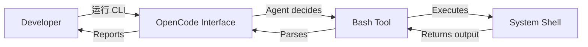

# CLI and Terminal Usage

> **Harness 职责**：这个模块定义人类意图、OpenCode、plugins 与系统 shell 之间的执行边界。

这个模块讨论如何诚实地记录命令、如何理解终端边界，以及怎样在 docs-first repo 里写出可信的命令说明。

---

## 为什么这很重要

终端是 harness 从“文档”变成“动作”的地方。
它也是最容易暴露假话的地方：发明的命令会失败，不安全的命令会破坏信任，含糊的 shell 边界会让 workflow 变脆弱。

这个模块就是为了让命令真相和执行边界保持诚实。

---

## 🧭 这个模块适合谁

如果你关心这些事情，就读最后一章：
- 想在 CLI 或 TUI 里使用 OpenCode
- 想在脚本或 shell 中组织工作流
- 想在 docs-first repo 里写出可信的命令文档

---

## ⏱️ 15 分钟内你能完成什么

读完之后，你应该能：
1. 解释 OpenCode 与系统 shell 的边界
2. 审查一个命令区块是否诚实
3. 在命令不存在时也能安全地写文档

---

## 这个模块假设什么，不假设什么

这个模块假设：
- 终端命令迟早会成为 harness 的一部分
- 命令文档也是 system of record 的一部分

这个模块不假设：
- repo 已经有 verified install / test / build 命令
- 每个终端任务都应该自动委托给 agent

---

## 🧠 OpenCode 与终端的关系

OpenCode 和终端通常有两层关系：
1. **作为界面**：你从 CLI 或 TUI 进入 OpenCode
2. **作为执行者**：OpenCode 通过 `bash` 等工具执行 shell 命令

---

## Demo case：审计一个命令区块是否诚实

### Situation
一个 repo 文档列出了 install、lint、test、build 等命令，但仓库里未必真的有支撑这些命令的文件。

### Goal
把这段命令文档改成“反映现实”，而不是“反映愿景”。

### Desired result
一个新 contributor 看到文档后，能准确知道：哪些命令已验证、哪些缺失、哪些仍是 `TBD`。

---

## 🛠️ Step-by-step workflow

1. **打开命令文档**
   - `AGENTS.md`
   - README 里的 command section
   - 其他 stack notes（如果有）
2. **列出每个声称存在的命令**
3. **问：哪个文件能证明它存在？**
   - package manifest
   - Makefile
   - CI config
   - tool config
4. **给每个命令分类**
   - verified
   - not yet present
   - `TBD`
5. **按分类重写文档**
6. **顺手检查 shell safety boundary**
   - 是否默认把 destructive command 写得太轻率？
   - 是否混淆了 built-in 行为和 plugin workflow？
7. **继续显式记录缺失，而不是替它补想象**

---

## Safety and boundaries

- OpenCode 会在当前工作目录运行命令
- 优先使用显式 `workdir`，而不是 `cd && ...`
- destructive commands 需要明确用户同意
- interactive commands 如果处理不当，容易卡住

终端层也是最容易把 built-in behavior、plugin behavior 和 community workflow layer 混淆在一起的地方。如果你想把这些边界看清楚，请读 [../PLUGINS-AND-OH-MY-OPENCODE.zh-CN.md](../PLUGINS-AND-OH-MY-OPENCODE.zh-CN.md)。

---

## 诚实命令文档检查清单

在写一个命令前，先确认：
- 哪个文件定义了它？
- 新 contributor 能不能从 repo 里找到它？
- 它是 local-only、CI-only，还是普通使用都适用？
- 它应该写成 verified、absent 还是 `TBD`？

---

## 常见失败模式与修复

### 失败模式 1：因为“大多数 repo 都有”就把命令写进去
修复：必须用真实文件做证据。

### 失败模式 2：在文档里轻率暴露 destructive command
修复：把 consent boundary 写清楚。

### 失败模式 3：把 plugin workflow 和 native CLI 行为混为一谈
修复：把 capability boundary 单独说明并回链到 plugin guide。

---

## Reader outcome

学完这个模块后，你应该能写出反映 repo 现实的命令文档，并保留清晰的 shell safety boundary。

---

## 🎉 Conclusion

你已经走完这个仓库当前的核心 Harness 路径。现在你应该已经能把 OpenCode 锚定在现实里，使用结构化执行合同，理解技能和代理，判断自动化边界，并以更真实的方式定义命令与终端边界。

具体功能行为仍然应回到 [OpenCode 官方文档](https://opencode.ai/docs/)。

- [返回路线图](../LEARNING-ROADMAP.zh-CN.md)
- [查看目录](../CATALOG.zh-CN.md)
