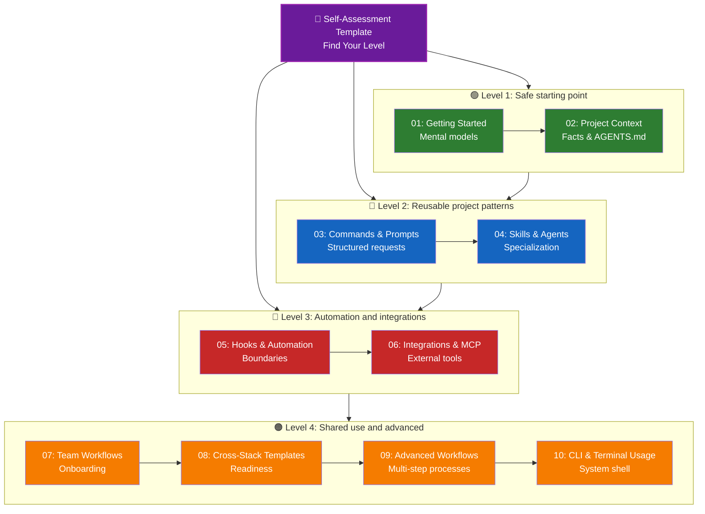

# OpenCode Learning Roadmap

This roadmap is for people using OpenCode for the first time.
It now works alongside the root quick-reference and index docs, so you can choose either a fast-start path or a full module path.

> **Current status**: Modules `01` through `10` exist as documentation modules. Starter templates exist across the learning path. Deeper examples and stack-specific starter kits are still planned.

---

## 🧭 Find Your Level

Not everyone starts from the same place. Use this quick self-assessment prompt set to estimate the right entry point.

**Answer these questions honestly:**
- [ ] I can start OpenCode and have a basic conversation.
- [ ] I have created an `AGENTS.md` or similar context file.
- [ ] I use structured prompt templates (e.g., `PLAN-REQUEST.md`).
- [ ] I have used specialized agents like `explore` or `librarian`.
- [ ] I have configured an MCP server to connect external tools.
- [ ] I have set up hooks or defined clear automation boundaries.

**Your Level:**
| Checks | Level | Start At | Focus |
|--------|-------|----------|-------|
| 0-1 | **Level 1: Beginner** | [01 - Getting Started](01-getting-started/README.md) | Safe starting points |
| 2-3 | **Level 2: Intermediate** | [04 - Skills and Agents](04-skills-and-agents/README.md) | Reusable patterns |
| 4-6 | **Level 3: Advanced** | [06 - Integrations and MCP](06-integrations-and-mcp/README.md) | Automation & Integration |

> **Template version**: This repository includes a starter self-assessment skill template at [`04-skills-and-agents/templates/skills/self-assessment/SKILL.md`](04-skills-and-agents/templates/skills/self-assessment/SKILL.md). Use the companion README in that folder to copy and adapt it inside a real OpenCode skill setup.

---

## Learning tips

- start one level lower if you are unsure
- copy one template at a time instead of adopting everything at once
- mark unknowns as `TBD` instead of guessing
- do not assume package, test, lint, or build commands exist unless files verify them
- use [INDEX.md](INDEX.md) or [CATALOG.md](CATALOG.md) when you need to browse instead of hunt manually

---

## 🗺️ Your Learning Path

---

## 📊 Complete Roadmap Table

| Step | Module | Focus | Level | Outcome |
|------|--------|-------|-------|---------|
| **01** | [Getting Started](01-getting-started/README.md) | Safe habits, starter `AGENTS.md` | L1 | Comfortable first-time user |
| **02** | [Project Context](02-project-context/README.md) | Verified facts, context files | L1 | No more hallucinated commands |
| **03** | [Commands & Prompts](03-commands-and-prompts/README.md) | Reusable request structure | L2 | Predictable task execution |
| **04** | [Skills & Agents](04-skills-and-agents/README.md) | Official OpenCode capabilities | L2 | Knowing when to specialize |
| **05** | [Hooks & Automation](05-hooks-and-automation/README.md) | Automation boundaries | L3 | Safer quality gates |
| **06** | [Integrations & MCP](06-integrations-and-mcp/README.md) | MCP and local secrets | L3 | Secure external connections |
| **07** | [Team Workflows](07-team-workflows/README.md) | Onboarding, shared conventions | L4 | Zero "works on my machine" excuses |
| **08** | [Cross-Stack Templates](08-cross-stack-templates/README.md) | When stack starters are justified | L4 | Better starter-kit readiness judgment |
| **09** | [Advanced Workflows](09-advanced-workflows/README.md) | Multi-step review processes | L4 | Better coordination guidance for repeated work |
| **10** | [CLI & Terminal Usage](10-cli-and-terminal/README.md) | Truthful command documentation | L4 | Better terminal-facing documentation habits |

---

## Time-based paths

### If You Only Have 15 Minutes
**Goal**: Get your first win
1. Read [01-getting-started/README.md](01-getting-started/README.md)
2. Adapt [01-getting-started/templates/AGENTS.md](01-getting-started/templates/AGENTS.md)
3. Fill in real repo facts with [02-project-context/templates/PROJECT-FACTS-CHECKLIST.md](02-project-context/templates/PROJECT-FACTS-CHECKLIST.md)
4. Ask OpenCode a question grounded in that context

### If You Have 1 Hour
**Goal**: Set up essential productivity tools
1. **Context** (15 min): Create your `AGENTS.md` and verify project facts.
2. **Prompts** (15 min): Test the `PLAN-REQUEST.md` for a real task.
3. **Skills** (15 min): Read and adapt the self-assessment skill template, or try using an `explore` agent in a real OpenCode session.
4. **Team Alignment** (15 min): Review the Team Onboarding Checklist to ensure your project is ready for others.

### If You Have a Weekend
**Goal**: Build a complete first-pass OpenCode learning base
1. Read modules [01](01-getting-started/README.md) through [03](03-commands-and-prompts/README.md) for safe setup and better requests.
2. Continue into [04](04-skills-and-agents/README.md) through [07](07-team-workflows/README.md) for specialization, automation boundaries, integrations, and onboarding.
3. Use [08](08-cross-stack-templates/README.md) through [10](10-cli-and-terminal/README.md) as advanced guidance once your repository has enough structure to support them.
4. Keep `TBD` boundaries intact anywhere your real repository still lacks commands or tooling.

---

## What is still future work

This roadmap is backed by real module files, but some later-phase content is still future work:
- stack-specific starter kits
- verified command guides tied to real manifests
- deeper examples for automation and integrations
- more reusable templates per module

That is the right boundary for now. The structure exists. The next phase is depth.
