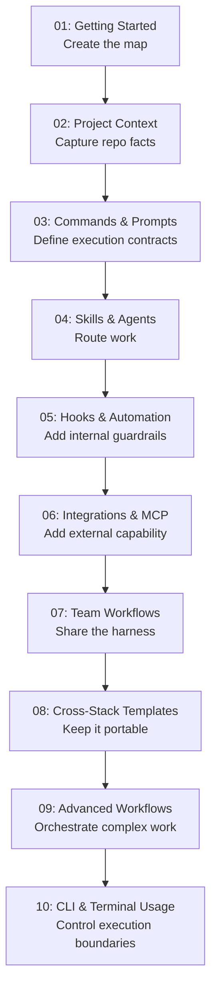

# OpenCode Harness Roadmap

This roadmap is for people who want to build a reliable **OpenCode harness**, not just learn isolated features.

> **Current status**: The repository already contains a first-pass harness scaffold in English and Chinese. Deeper feedback-loop examples and stack-specific harness kits are still future work.

---

## 🧭 What stage is your harness in?

Use these questions to estimate your current stage:

- [ ] I have a readable repo entry point for agents (`AGENTS.md` or equivalent)
- [ ] My repo facts are documented instead of being tribal knowledge
- [ ] I use structured execution contracts instead of vague one-off prompts
- [ ] I know when to route work to a specialized agent or skill
- [ ] I have at least one feedback loop, such as diagnostics, tests, or review contracts
- [ ] I understand the difference between built-in tools, plugins, and MCP servers
- [ ] I have a plan for drift, onboarding, and long-term harness maintenance

| Checks | Stage | Start at | Focus |
|--------|-------|----------|-------|
| 0-2 | **Stage 1: Map** | [01 - Getting Started](01-getting-started/README.md) | create the harness entry point |
| 3-4 | **Stage 2: Constraints** | [03 - Commands & Prompts](03-commands-and-prompts/README.md) | define execution contracts and routing |
| 5-7 | **Stage 3: Feedback** | [05 - Hooks & Automation](05-hooks-and-automation/README.md) | expand capability and correction loops |

---

## Harness principles for this repo

- the repo is the system of record
- progressive disclosure beats giant instructions
- constraints are more reliable than micromanagement
- feedback loops matter more than raw generation speed
- entropy management is part of the job, not cleanup someone does later

---

## 🗺️ Harness build path

---

## 📊 Complete harness roadmap

| Step | Module | Harness job | Outcome |
|------|--------|-------------|---------|
| **01** | [Getting Started](01-getting-started/README.md) | create the initial harness entry point | the agent has a map |
| **02** | [Project Context](02-project-context/README.md) | establish the repo as system of record | fewer hallucinated assumptions |
| **03** | [Commands & Prompts](03-commands-and-prompts/README.md) | define execution contracts | clearer intent and better plans |
| **04** | [Skills & Agents](04-skills-and-agents/README.md) | route work to the right capability | less random execution |
| **05** | [Hooks & Automation](05-hooks-and-automation/README.md) | add internal guardrails | safer repeated work |
| **06** | [Integrations & MCP](06-integrations-and-mcp/README.md) | add external capability safely | broader reach without chaos |
| **07** | [Team Workflows](07-team-workflows/README.md) | make the harness shareable | less tribal knowledge |
| **08** | [Cross-Stack Templates](08-cross-stack-templates/README.md) | keep the harness portable | better reuse across repos |
| **09** | [Advanced Workflows](09-advanced-workflows/README.md) | orchestrate complex multi-step work | higher leverage automation |
| **10** | [CLI & Terminal Usage](10-cli-and-terminal/README.md) | define shell boundaries | safer execution control |

---

## Time-based paths

### If you only have 15 minutes
1. Build the map with [01-getting-started/templates/AGENTS.md](01-getting-started/templates/AGENTS.md)
2. Capture facts with [PROJECT-FACTS-CHECKLIST.md](02-project-context/templates/PROJECT-FACTS-CHECKLIST.md)
3. Choose one execution contract from [03-commands-and-prompts/README.md](03-commands-and-prompts/README.md)

### If you have 1 hour
1. **Map**: create or clean up `AGENTS.md`
2. **Facts**: verify commands and repo reality
3. **Contracts**: adopt one planning or review template
4. **Routing**: decide whether you need skills, agents, plugins, or MCP

### If you have a weekend
1. Build the root harness layer with modules [01](01-getting-started/README.md) through [03](03-commands-and-prompts/README.md)
2. Add capability and feedback loops with [04](04-skills-and-agents/README.md) through [06](06-integrations-and-mcp/README.md)
3. Make the harness durable with [07](07-team-workflows/README.md) through [10](10-cli-and-terminal/README.md)
4. Keep every unknown as `TBD` until real files justify stronger claims

---

## What is still future work

- deeper feedback-loop examples backed by real tooling
- stronger observability or test-loop examples
- stack-specific harness kits with verified commands
- more entropy-management patterns for long-lived repos
