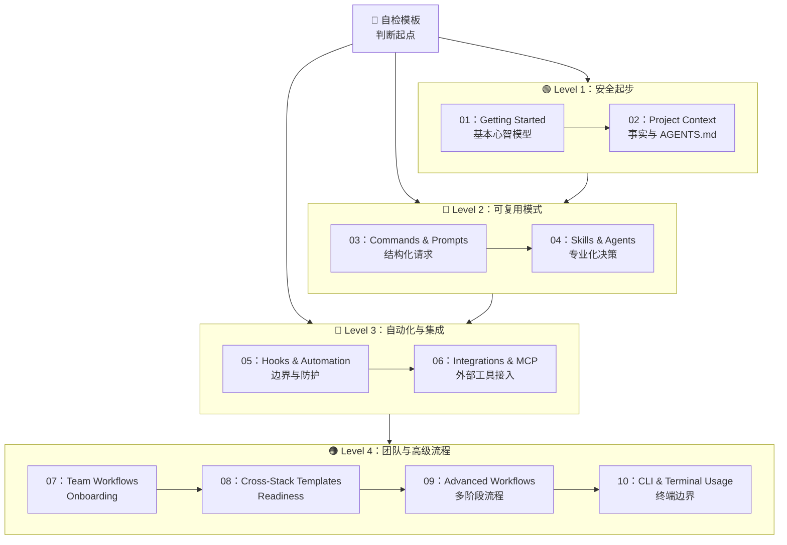

# OpenCode 学习路线图（中文版）

**语言 / Language：** [简体中文](LEARNING-ROADMAP.zh-CN.md) | [English](LEARNING-ROADMAP.md)

这份路线图面向第一次使用 OpenCode 的人。它和中文快速参考、中文索引一起工作，让你可以按时间或按模块顺序学习。

> **当前状态**：`01` 到 `10` 的文档模块已经存在，并且现在都有中文 README 入口。起步模板存在，但模板正文目前主要仍为英文。

---

## 🧭 判断你的起点

每个人的起点不一样。你可以用下面这组问题快速判断自己应该从哪里开始。

- [ ] 我已经能启动 OpenCode 并进行基本对话
- [ ] 我写过 `AGENTS.md` 或类似的上下文文件
- [ ] 我会使用结构化请求模板（例如 `PLAN-REQUEST.md`）
- [ ] 我使用过 `explore`、`librarian` 之类的专业代理
- [ ] 我配置过 MCP 服务连接外部工具
- [ ] 我理解 hooks 或自动化边界

| 勾选数 | 级别 | 建议开始位置 | 重点 |
|---|---|---|---|
| 0-1 | **Level 1：Beginner** | [01 - Getting Started](01-getting-started/README.zh-CN.md) | 安全起步 |
| 2-3 | **Level 2：Intermediate** | [04 - Skills and Agents](04-skills-and-agents/README.zh-CN.md) | 可复用模式 |
| 4-6 | **Level 3：Advanced** | [06 - Integrations and MCP](06-integrations-and-mcp/README.zh-CN.md) | 自动化与集成 |

> **模板版自检**：仓库中有一个 self-assessment 技能模板说明页：[`04-skills-and-agents/templates/skills/self-assessment/README.md`](04-skills-and-agents/templates/skills/self-assessment/README.md)。它是模板说明，不是已经启用的仓库功能。

---

## 学习建议

- 如果不确定，从更低一级开始通常更安全
- 一次只复制一个模板，不要一次全上
- 遇到未知内容时，写 `TBD` 而不是猜
- 不要假设仓库里已经有 package、lint、test 或 build 命令
- 需要浏览时优先用 [INDEX.zh-CN.md](INDEX.zh-CN.md) 或 [CATALOG.zh-CN.md](CATALOG.zh-CN.md)

---

## 🗺️ 你的学习路径

---

## 📊 完整路线表

| 步骤 | 模块 | 重点 | 级别 | 收获 |
|---|---|---|---|---|
| 01 | [Getting Started](01-getting-started/README.zh-CN.md) | 安全习惯、起步 `AGENTS.md` | L1 | 成为可以安全开始的新手 |
| 02 | [Project Context](02-project-context/README.zh-CN.md) | 已验证事实、上下文文件 | L1 | 减少幻觉式命令和假设 |
| 03 | [Commands & Prompts](03-commands-and-prompts/README.zh-CN.md) | 可复用请求结构 | L2 | 请求更稳定 |
| 04 | [Skills & Agents](04-skills-and-agents/README.zh-CN.md) | 官方 OpenCode 能力与专业化判断 | L2 | 知道什么时候该正式复用 |
| 05 | [Hooks & Automation](05-hooks-and-automation/README.zh-CN.md) | 自动化边界 | L3 | 更安全的质量门槛 |
| 06 | [Integrations & MCP](06-integrations-and-mcp/README.zh-CN.md) | MCP 与本地 secrets | L3 | 更安全地连接外部工具 |
| 07 | [Team Workflows](07-team-workflows/README.zh-CN.md) | onboarding 与共享约定 | L4 | 团队更少靠口头传承 |
| 08 | [Cross-Stack Templates](08-cross-stack-templates/README.zh-CN.md) | 什么时候该做 stack starter | L4 | 更好地判断 starter readiness |
| 09 | [Advanced Workflows](09-advanced-workflows/README.zh-CN.md) | 多阶段流程设计 | L4 | 更好地协调重复性复杂工作 |
| 10 | [CLI & Terminal Usage](10-cli-and-terminal/README.zh-CN.md) | 真实命令文档 | L4 | 更好的终端文档与边界意识 |

---

## 按时间选择路径

### 如果你只有 15 分钟

1. 读 [01-getting-started/README.zh-CN.md](01-getting-started/README.zh-CN.md)
2. 参考 [01-getting-started/templates/AGENTS.md](01-getting-started/templates/AGENTS.md)
3. 用 [02-project-context/templates/PROJECT-FACTS-CHECKLIST.md](02-project-context/templates/PROJECT-FACTS-CHECKLIST.md) 填写真是仓库事实
4. 再带着这些上下文去问 OpenCode 一个真实问题

### 如果你有 1 小时

1. **上下文**（15 分钟）：完成 `AGENTS.md` 起步稿并核对仓库事实
2. **请求模板**（15 分钟）：试一次 `PLAN-REQUEST.md` 或 `REVIEW-REQUEST.md`
3. **专业化**（15 分钟）：阅读 [04-skills-and-agents/README.zh-CN.md](04-skills-and-agents/README.zh-CN.md)
4. **团队视角**（15 分钟）：浏览 [07-team-workflows/README.zh-CN.md](07-team-workflows/README.zh-CN.md)

### 如果你有一个周末

1. 先读 [01](01-getting-started/README.zh-CN.md) 到 [03](03-commands-and-prompts/README.zh-CN.md)，建立安全起点和更好的请求方式
2. 再读 [04](04-skills-and-agents/README.zh-CN.md) 到 [07](07-team-workflows/README.zh-CN.md)，理解专业化、自动化边界、MCP 与团队协作
3. 最后按需进入 [08](08-cross-stack-templates/README.zh-CN.md) 到 [10](10-cli-and-terminal/README.zh-CN.md)
4. 全程保持 `TBD` 边界，不要把未来计划写成当前事实

---

## 仍在未来阶段的内容

这份路线图有真实文件支撑，但下面这些内容仍然属于未来工作：

- 带已验证命令的 stack-specific starter kits
- 与真实 manifest 绑定的命令参考
- 更深入的自动化示例
- 更深入的 MCP / integration 示例
- 中文版模板正文

当前最合理的边界就是这样：结构已经有了，接下来是逐步加深。
