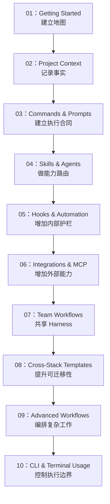

# OpenCode Harness 路线图

这份路线图面向的是：想为 OpenCode 建立一套可靠 **harness** 的人，而不只是零散学习单个功能的人。

> **当前状态**：仓库已经有第一版中英文 harness 骨架。更深入的 feedback loop 示例和 stack-specific harness kit 仍然属于未来工作。

---

## 🧭 你的 Harness 现在处于哪个阶段？

用这些问题判断你当前的阶段：

- [ ] 我已经给 agent 提供了可读入口，例如 `AGENTS.md`
- [ ] 仓库事实已经写进 repo，而不是只存在于人口述里
- [ ] 我使用的是结构化执行合同，而不是模糊的一次性 prompt
- [ ] 我知道什么时候该把任务路由给 skill 或 agent
- [ ] 我已经有至少一条 feedback loop，例如 diagnostics、tests 或 review contract
- [ ] 我理解 built-in tools、plugins 和 MCP servers 的区别
- [ ] 我已经考虑过 drift、onboarding 和长期维护问题

| 勾选数 | 阶段 | 建议开始位置 | 重点 |
|---|---|---|---|
| 0-2 | **阶段 1：Map** | [01 - Getting Started](01-getting-started/README.zh-CN.md) | 建立 harness 入口 |
| 3-4 | **阶段 2：Constraints** | [03 - Commands & Prompts](03-commands-and-prompts/README.zh-CN.md) | 建立执行合同和路由 |
| 5-7 | **阶段 3：Feedback** | [05 - Hooks & Automation](05-hooks-and-automation/README.zh-CN.md) | 扩展能力和纠错回路 |

---

## 这个仓库使用的 Harness 原则

- 仓库本身是 system of record
- progressive disclosure 比“大而全说明书”更可靠
- 约束比微观管理更可靠
- feedback loop 比单次生成速度更重要
- entropy management 是日常工作的一部分，不是以后再补的清理活

---

## 🗺️ Harness 构建路径

---

## 📊 完整 Harness 路线表

| 步骤 | 模块 | Harness 职责 | 结果 |
|---|---|---|---|
| **01** | [Getting Started](01-getting-started/README.zh-CN.md) | 建立初始 harness 入口 | agent 有地图可看 |
| **02** | [Project Context](02-project-context/README.zh-CN.md) | 把仓库变成 system of record | 更少幻觉式假设 |
| **03** | [Commands & Prompts](03-commands-and-prompts/README.zh-CN.md) | 建立执行合同 | 意图更清晰，计划更稳定 |
| **04** | [Skills & Agents](04-skills-and-agents/README.zh-CN.md) | 把任务路由到正确能力 | 更少随机执行 |
| **05** | [Hooks & Automation](05-hooks-and-automation/README.zh-CN.md) | 增加内部护栏 | 重复工作更安全 |
| **06** | [Integrations & MCP](06-integrations-and-mcp/README.zh-CN.md) | 安全增加外部能力 | 能力变强但不失控 |
| **07** | [Team Workflows](07-team-workflows/README.zh-CN.md) | 让 harness 可共享 | 更少 tribal knowledge |
| **08** | [Cross-Stack Templates](08-cross-stack-templates/README.zh-CN.md) | 提高可迁移性 | 更容易跨仓库复用 |
| **09** | [Advanced Workflows](09-advanced-workflows/README.zh-CN.md) | 编排复杂多阶段工作 | 更高杠杆的自动化 |
| **10** | [CLI & Terminal Usage](10-cli-and-terminal/README.zh-CN.md) | 定义 shell 边界 | 执行控制更安全 |

---

## 按时间选择路径

### 如果你只有 15 分钟
1. 用 [01-getting-started/templates/AGENTS.md](01-getting-started/templates/AGENTS.md) 建地图
2. 用 [PROJECT-FACTS-CHECKLIST.md](02-project-context/templates/PROJECT-FACTS-CHECKLIST.md) 写事实
3. 从 [03-commands-and-prompts/README.zh-CN.md](03-commands-and-prompts/README.zh-CN.md) 里选一个执行合同

### 如果你有 1 小时
1. **Map**：创建或清理 `AGENTS.md`
2. **Facts**：验证命令和仓库现实
3. **Contracts**：采用一个 planning 或 review 模板
4. **Routing**：判断是否需要 skills、agents、plugins 或 MCP

### 如果你有一个周末
1. 用 [01](01-getting-started/README.zh-CN.md) 到 [03](03-commands-and-prompts/README.zh-CN.md) 建立根 harness
2. 用 [04](04-skills-and-agents/README.zh-CN.md) 到 [06](06-integrations-and-mcp/README.zh-CN.md) 增加能力和 feedback loops
3. 用 [07](07-team-workflows/README.zh-CN.md) 到 [10](10-cli-and-terminal/README.zh-CN.md) 让 harness 更 durable
4. 所有未知内容继续标记为 `TBD`

---

## 仍在未来阶段的内容

- 更深入的 feedback loop 示例
- 绑定真实观测或测试系统的例子
- 带已验证命令的 stack-specific harness kit
- 更多长期 entropy management 模式
